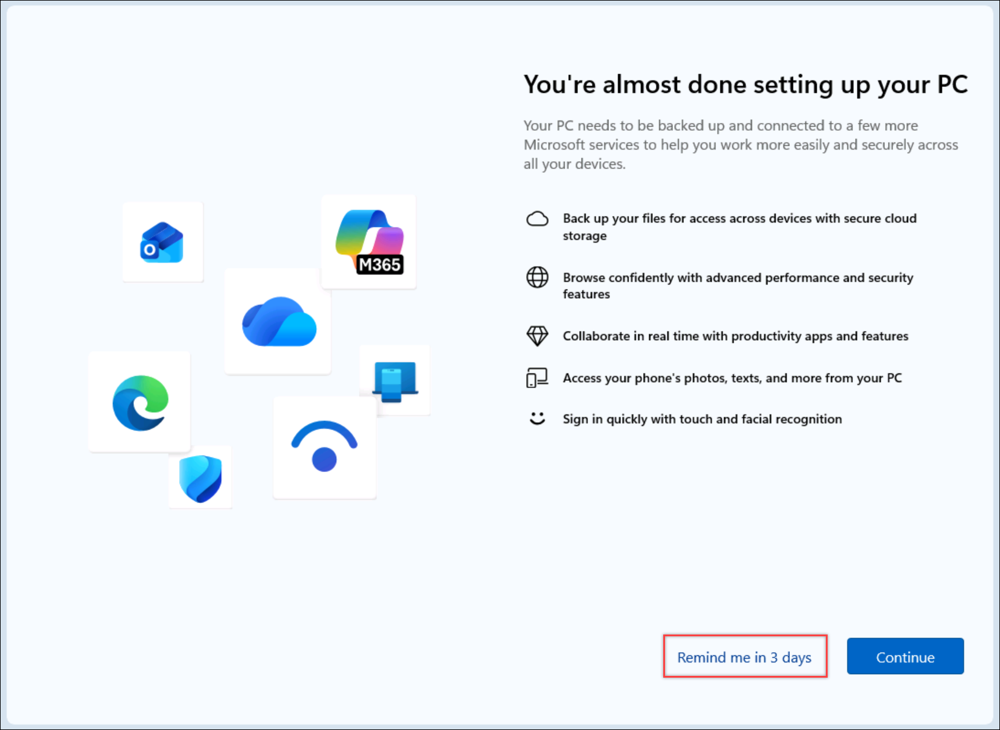

@lab.Title

# Welcome to Your Lab Environment

Before we begin working through the labs, let's get familiar with the lab environment which is hosted on a platform called Skillable. You will be provided with a ready to go lab environment that requires only a web browser. 

The following items have been pre-provisioned for you:

- A virtual machine where all the lab work will be completed.
- A local login for the virtual machine. 
- An Entra ID account for use with Microsoft Azure and Microsoft Fabric.
- An F4 Fabric Capacity.

This lab will not require you to download or upload any datasets and will not require the use of any client tools like VS Code or Power BI Desktop although many activities which will be performed in the web browser can be done using client tools.

## User Credentials and Resources

While the labs will try to surface credentials in line where necessary, they are also available on the Resources tab for reference at any time.

The following credentials will be used throughout the lab experience:

**Virtual Machine**

- Username: @lab.VirtualMachine(Win11-Pro-Base).Username
- Password: @lab.VirtualMachine(Win11-Pro-Base).Password

**Microsoft Fabric and Azure Portal**

- Entra username: @lab.CloudPortalCredential(User1).Username
- Entra password: @lab.CloudPortalCredential(User1).Password
- Entra temporary access pass (TAP): @lab.CloudPortalCredential(User1).TAP
- Fabric Capacity Name: @lab.CloudResourceTemplate(FabricPerUserPOCv3).Parameters[capacityName]

## Interacting with your lab environment
- Text formatted as an +++example+++ represents type text. Clicking on this text will automatically insert it where your cursor is located to prevent any typing errors.
- Text formatted as an ++example++ represents copy text. Clicking on this text will copy it to your clipboard and can then be pasted to prevent any typing errors.
- Text formatted as an [example](https://www.microsoft.com/en-us/microsoft-fabric/getting-started) is a hyperlink that will open in a new browser tab or window.

## Logging into the virtual machine for the first time

When the virtual machine login screen appears, it should be ready to accept the password for the **@lab.VirtualMachine(Win11-Pro-Base).Username** user.

1. In the **Password** box enter +++@lab.VirtualMachine(Win11-Pro-Base).Password+++.

1. Press **Enter** on the keyboard or click on the right arrow to login.

1. On the **You're almost done setting up your PC** screen, select **Remind me in 3 days**.

## Next steps
In this lab you familiarized yourself with the Skillable lab environment, explored the various logins that will be used throughout the labs, and logged into your virtual machine for the first time.

- Select **Next** to continue to **Lab 1 - Getting started**
