# End-to-End Data Engineering: <br> Modern Data Warehousing on Microsoft Fabric

## Lab 1 - Getting started

Before you begin:

- Make sure you have read the overview on the [workshop homepage](<../README.md>).
- If you have not completed [Lab 0 - Lab environment setup](<00 - Lab environment setup.md>), go complete all the steps then return here to continue.

This lab will cover:

- <a href="#1.1">Exploring the Fabric UX</a>
- <a href="#1.2">Using client tools</a>
- <a href="#1.3">T-SQL notebooks</a>

<hr>

<h3 id="1.1">1.1 - Exploring the Fabric UX</h3>

*Note: Lab 1.1 - Exploring the Fabric UX is **optional** and **does not** affect your ability to complete any future labs.*

1. Return to the *Modern Data Warehousing on Microsoft Fabric* workspace created in *Lab 0 - Lab environment setup* by selecting the **workspace icon** from the left navigation bar. 

    *Note: The icons on the navigation bar can be pinned and unpinned. Therefore, the icons you see may differ from the screenshot.*

    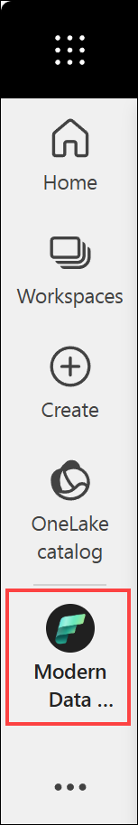

1. From the item list, select **WideWorldImportersDW** data warehouse.

    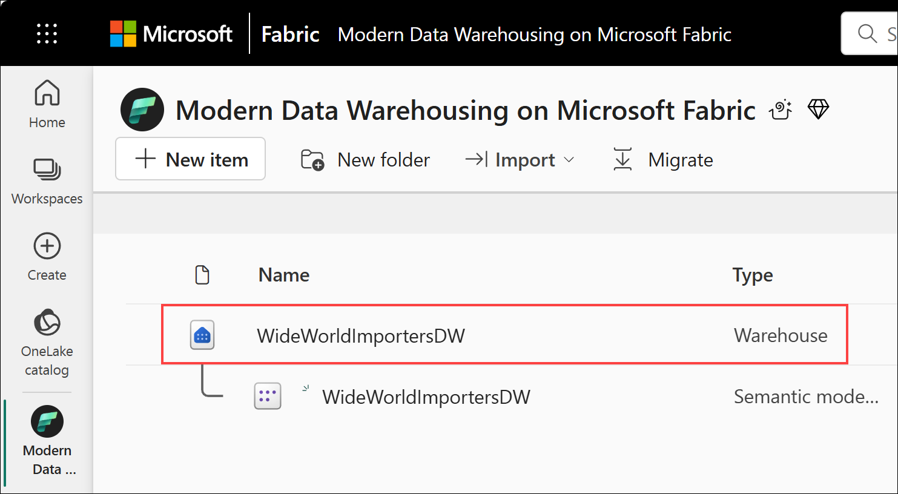

1. After WideWorldImportersDW loads, explore the interface and note a few key items.

    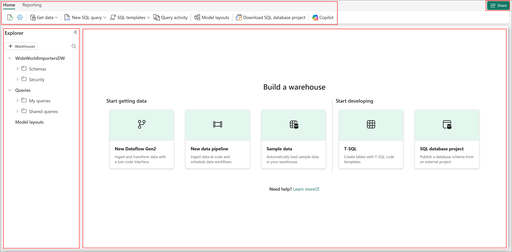

    - **Explorer** can display one or more warehouses to browse database objects and a set of queries tied to the current data warehouse. Items displayed include:
        - Attach warehouse or SQL analytics endpoint
        - Warehouses (tables, stored procedures, views, functions, security roles, etc.)
        - Queries
    - **Ribbon** contains actions for interacting with the warehouse and semantic model including:
        - Get data (New pipeline or Dataflow Gen2)
        - New query (blank script, visual query, or notebook)
        - Templates for new tables, stored procedures, and more
        - Query activity monitor
        - Semantic model layout
        - Download SQL database project
        - Reporting
    - **Canvas** makes up the majority of the screen and will change based on where you are and what is selected. Items displayed include:
        - When no objects exist in the warehouse quick actions to get data, load sample data, write queries, or use a database project will be displayed. 
        - Data preview when selecting a table from the Explorer. 
        - Query editor
        - Visual query editor
        - Semantic model layout
    - **Share** grants acceess to the currently open warehouse only providing options for varying permissions levels including:
        - Read all data using SQL
        - Read all OneLake data
        - Build reports on the default semantic mode

1. From the **Home** tab of the ribbon, select **SQL templates -> New table** to open the template. 

1. Select **Run** from the top of the query editor tab for *SQL query 1*. Locate the following items after the query completes:

    - **Total query runtime** is displayed below the messages/results pane at the bottom of the screen.
    - The **distributed statement id** is included in the messages output. This is a unique identifier for each query executed used to locate queries in Fabric's query insights, DMVs, and may be requested if you need to open a support ticket for Microsoft to investigate a case. 
    - The **green spinning circle** next to the warehouse name in the Explorer indicates a DDL operation was run and the Explorer has been automatically refreshed. 
    
    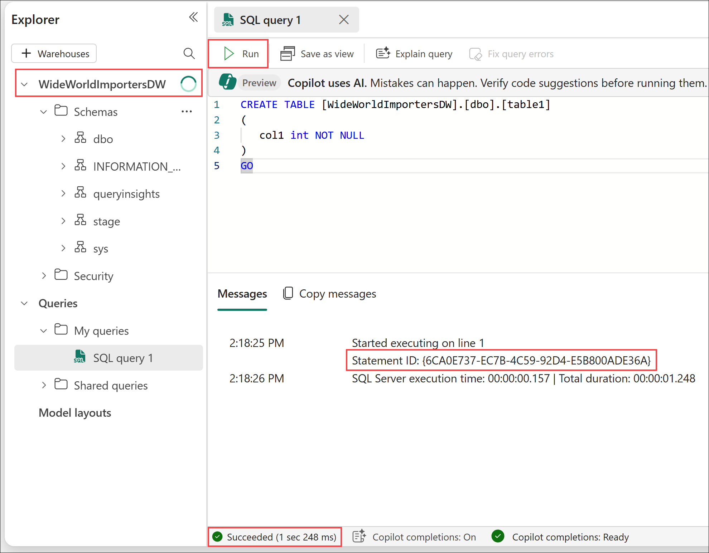

1. In the **Explorer** expand **Schemas -> dbo -> Tables** and locate **table1** to be sure it was created successfully.

    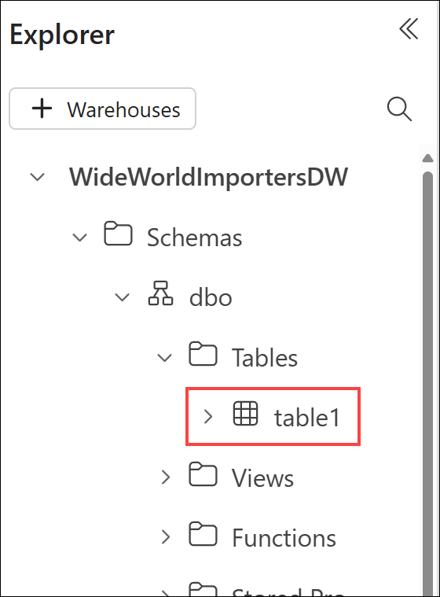

1. In the query window, add two new lines to the end of the existing query and type the following query to insert two records into the newly created table:

    ``` sql
    INSERT INTO dbo.table1 VALUES (1), (2)
    ```

1. You can have multiple statements in the same query but selectively run portions of the query. To do this, in the query window, **highlight** the INSERT statement from the prior step, then select **Run** from the top of the query editor tab.

    *Note: In the messages window you will find the distributed statement id and the statement runtime below the messages window.*
    
    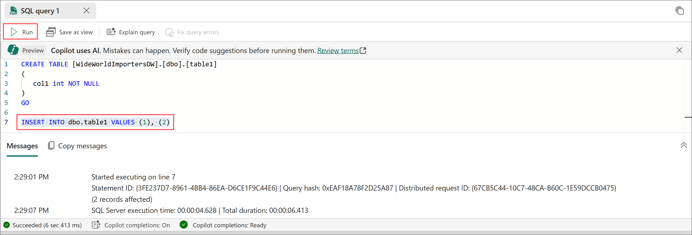

1. In the query window, add two lines to the end of the existing query and type the following query to return the records from table1:

    ``` sql
    SELECT * FROM dbo.table1
    ```

1. **Highlight** the SELECT statement from the prior step, then select **Run** from the top of the query editor tab.

    *Note: The results grid will be displayed and you can optionally view the messages output.*

    

1. From the **Explorer**, hover the mouse over **table1** click the ellipsis (**...**) that appears next to the table name, and select **New SQL query -> DROP** from the menu. A new query will open with the DROP TABLE statement.

    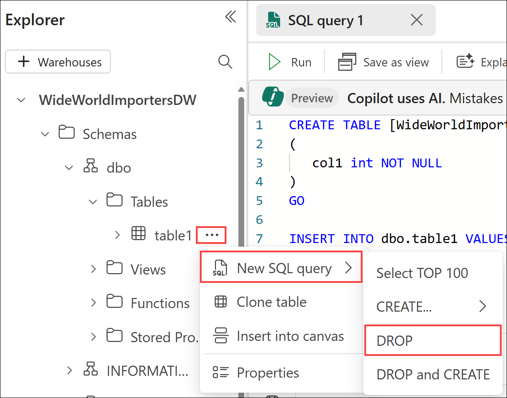

1. Select **Run** from the top of the query editor tab.

    *After the query completes the green spinning circle will appear next to the warehouse name in the Explorer indicating the Explorer is refreshing. After the refresh completes table1 will disappear from the table list.*

    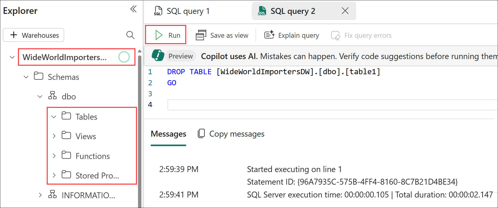

1. From the **Explorer**, go to the **Queries** section, hover the mouse over **SQL query 2**, click the ellipsis (**...**) that appears next to the query name, and select **Rename** from the menu. 

    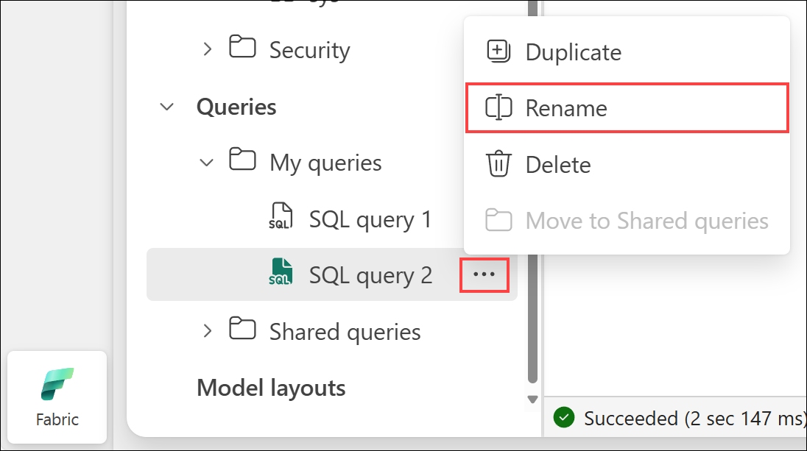

1. On the **Rename** dialog enter the name **Drop My Table** and select **Rename**. The query name should be updated in the Explorer pane. 

    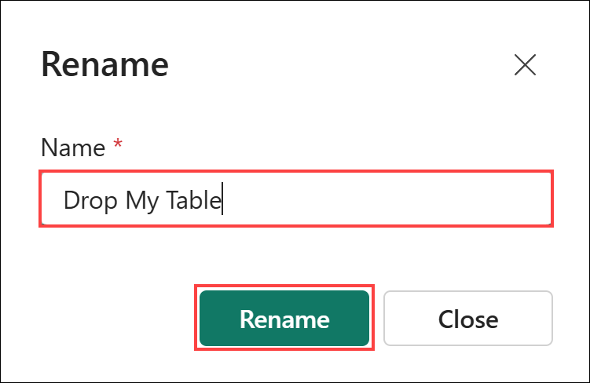

1. Clean up the queries created in this lab. From the **Explorer**, go to the **Queries** section, hover the mouse over **Drop My Table**, click the ellipsis (**...**) that appears next to the query name, and select **Delete** from the menu. 

    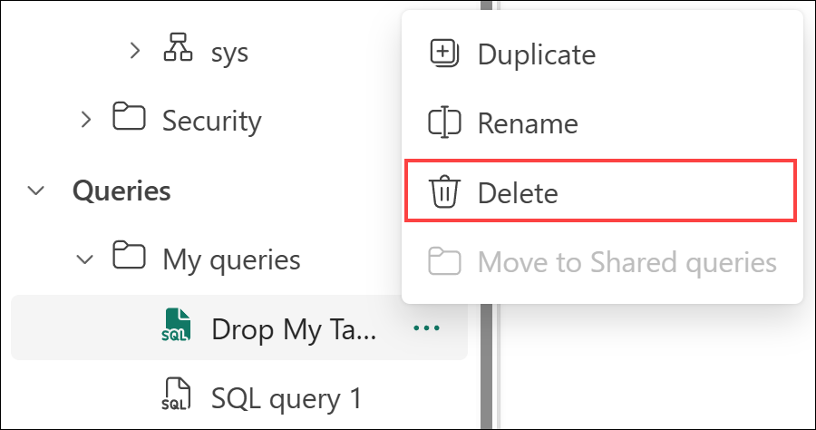

1. On the **Delete Query** dialog, select **Delete**. The action will be reflected in the Explorer and the query will disappear. 

    

1. Finish cleaning up the queries created in this lab. From the **Explorer**, go to the **Queries** section, hover the mouse over **SQL query 1**, click the ellipsis (**...**) that appears next to the query name, and select **Delete** from the menu. 

    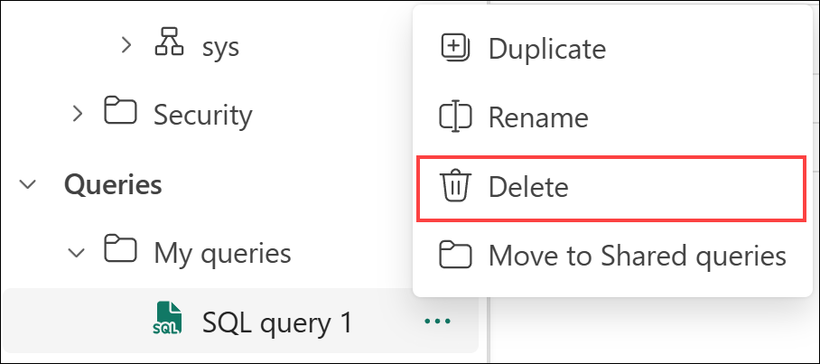

1. On the **Delete Query** dialog, select **Delete**. The action will be reflected in the Explorer and the query will disappear. 

    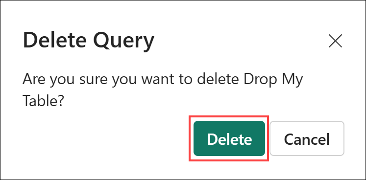

<h3 id="1.2">1.2 - Using client tools</h3>

*Note: Lab 1.2 - Using client tools is **optional** and **does not** affect your ability to complete any future labs. To complete this section you will also need to have a client tool like SQL Server Management Studio (SSMS) or Visual Studio Code with the MSSQL extension installed.*

1. With the warehouse still open, from the **Home** tab of the ribbon, select the **gear** icon from the ribbon to open the warehouse settings. 

    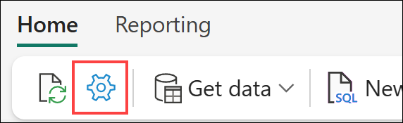

1. Select **SQL endpoint** from the left navigation on the warehouse settings pane. Select the **copy** button to the right of the **SQL connection string** to copy the server name to the clipboard. 

    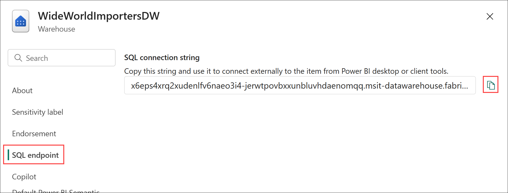

1. In your favorite client tool, use the value copied from the Fabric UX to connect to the workspace's SQL endpoint.

    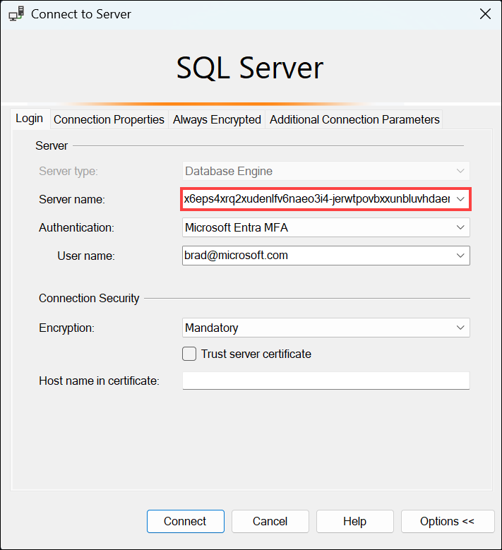

1. For example, in SSMS (SQL Server Management Studio), the Object Explorer displays all the warehouses and lakehouse SQL endpoints on the workspace.

    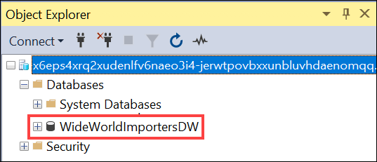

<h3 id = "1.3">1.3 - T-SQL notebooks</h3>

1. Download [The Workshop.ipynb](<../assets/code/The Workshop.ipynb>) notebook (found in the assets/code folder of the GitHub repo) and save it to your computer. This notebook will be used throughout the remaining labs so you do not need to copy/paste code frequently from the GitHub repo to the Fabric UX. For details on how the lab steps correspond to notebook cells review the **Notebook based experience** section near the bottom of the [workshop homepage](<../README.md>).

1. Return to the *Modern Data Warehousing on Microsoft Fabric* workspace created in *Lab 0 - Lab environment setup* by selecting the **workspace icon** from the left navigation bar. 

    *Note: The icons on the navigation bar can be pinned and unpinned. Therefore, the icons you see may differ from the screenshot.*

    

1. From the <b>Import</b> menu located just below the workspace name, select <b>Notebook -> From this computer</b>.

    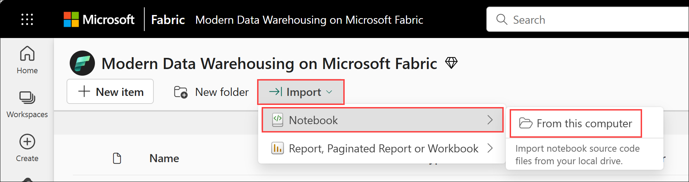

1. From the **Import status** pane on the right side of the screen, select **Upload**.

    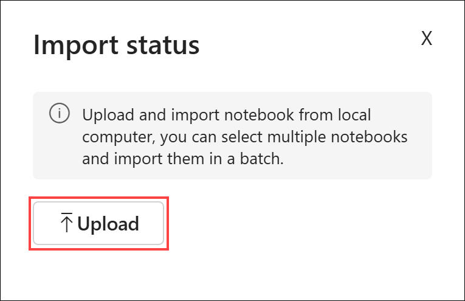

1. Locate and select the **The Workshop.ipynb** file on your computer. Select **Open**.

    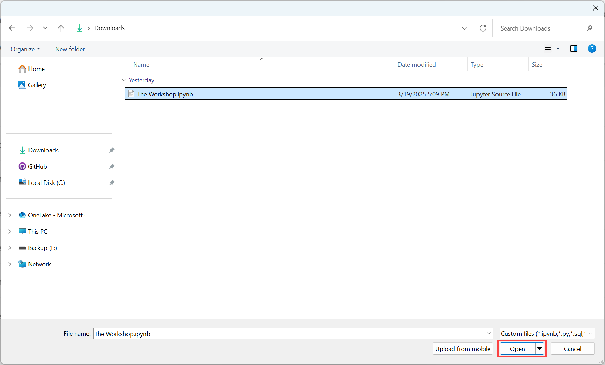

1. The notebook will be uploaded and appear in the workspace.

    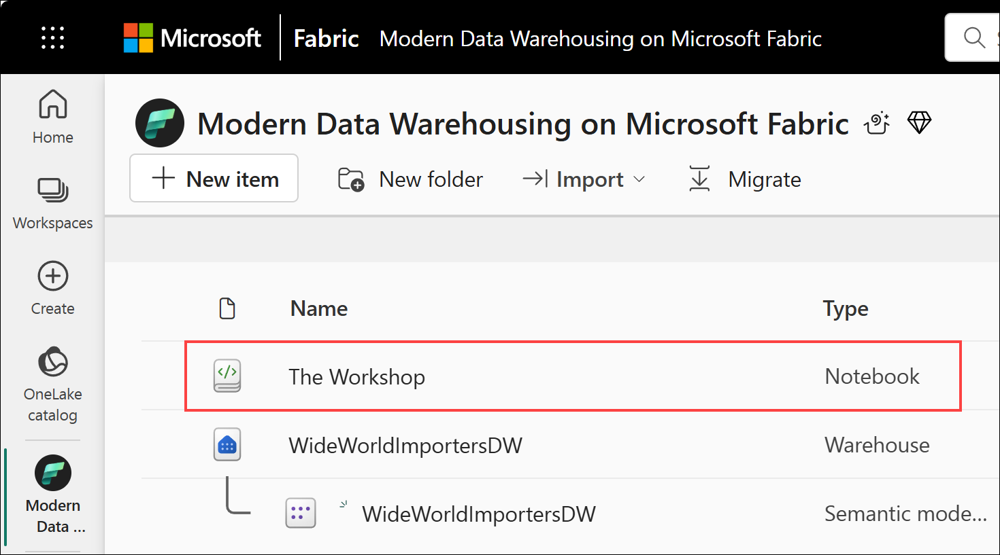

1. From the item list, select **The Workshop** notebook.

    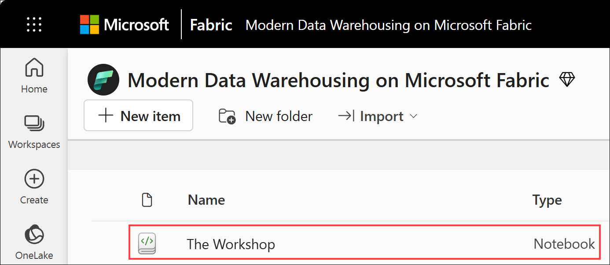

1. From the **Explorer** select **Add**.

    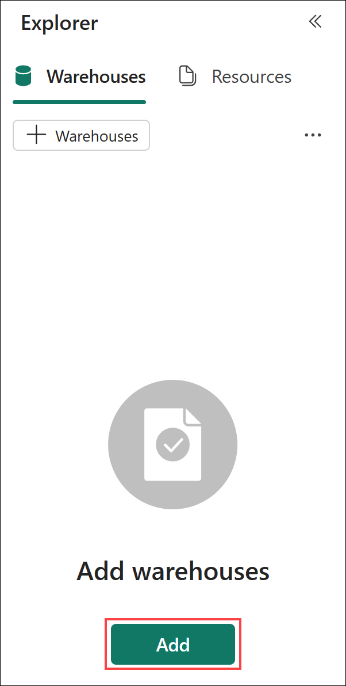

1. From the list of items in the OneLake catalog select the **WideWorldImportersDW** data warehouse. Then select **Confirm**. The WideWorldImportersDW will now be associated with the notebook and will be the default connection for any queries that are run from the notebook.

    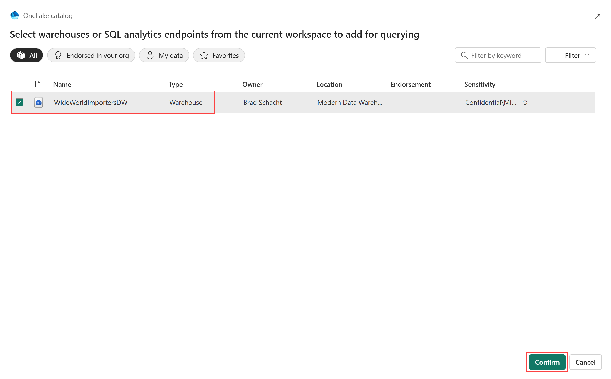

1. Validate the notebook is indeed connected to the proper database by running the cell for **Step 1.3.10** in *The Workshop* notebook and comparing the results to those in the screenshot below.

    ``` sql
    SELECT DB_NAME() AS DatabaseName
    ```

    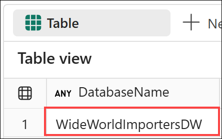

## Next steps
In this lab you explored many ways to interact with the Fabric data warehouse including the web browser, connecting client tools, and notebooks. This workshop mainly uses notebooks to prevent needing to copy/paste code between windows. 

- Continue to [Lab 2 - Data warehouse DDL](<02 - Data warehouse DDL.md>)
- Return to the [workshop homepage](<../README.md>)

## Additional Resources
- [T-SQL support in Microsoft Fabric notebooks](https://learn.microsoft.com/en-us/fabric/data-engineering/author-tsql-notebook)
- [View data in the Data preview in Microsoft Fabric](https://learn.microsoft.com/en-us/fabric/data-warehouse/data-preview)
- [Query using the SQL query editor](https://learn.microsoft.com/en-us/fabric/data-warehouse/sql-query-editor)
- [Query using the visual query editor](https://learn.microsoft.com/en-us/fabric/data-warehouse/visual-query-editor)
