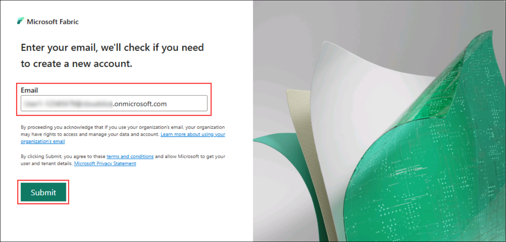
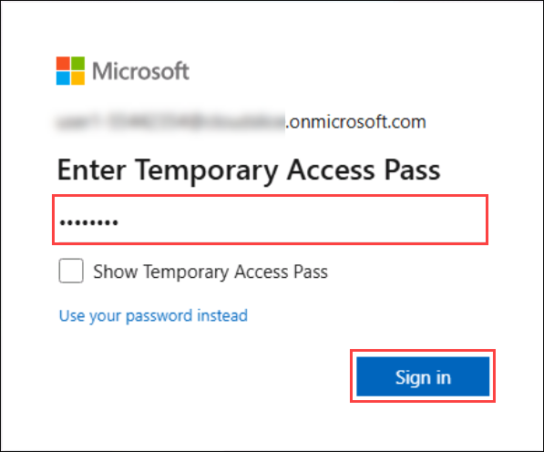
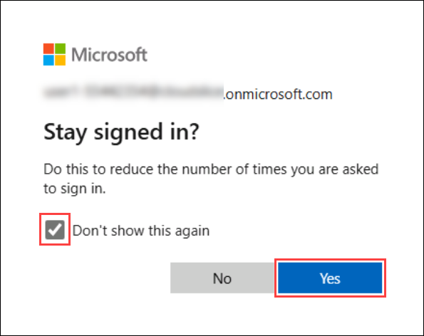
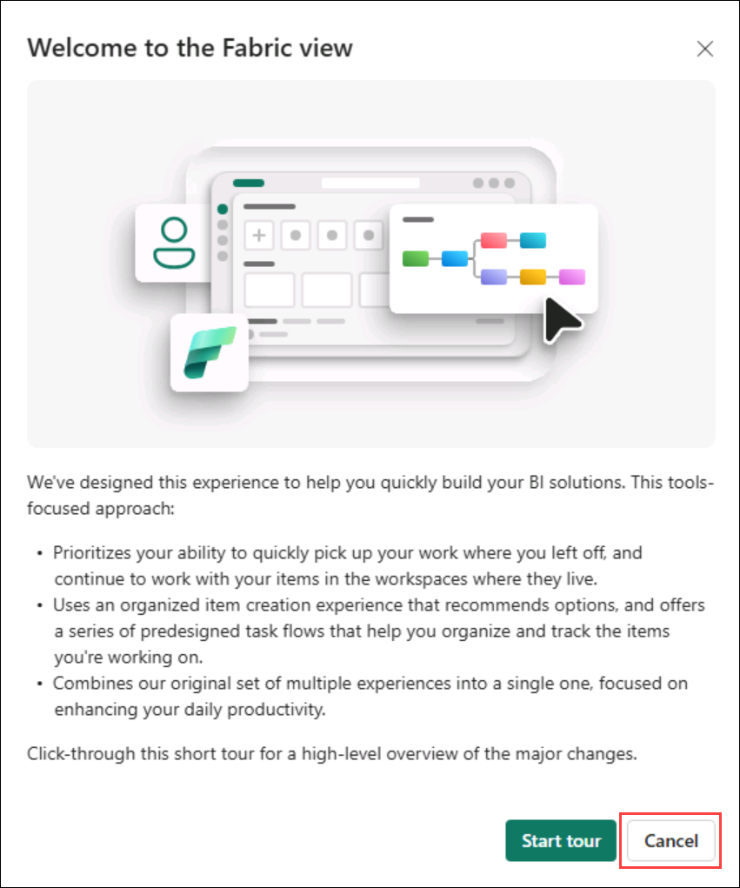
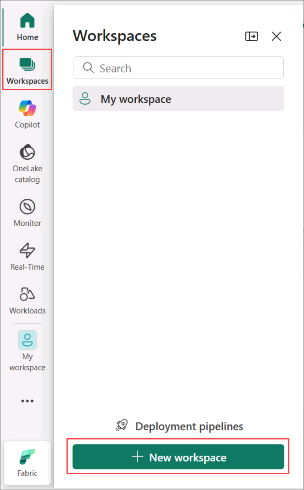
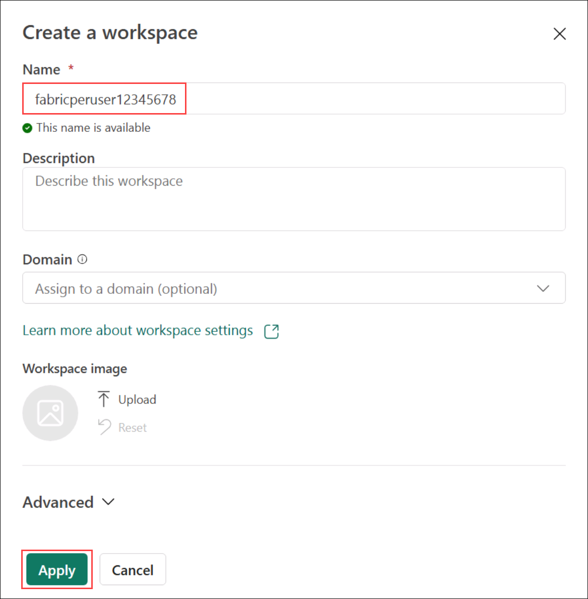
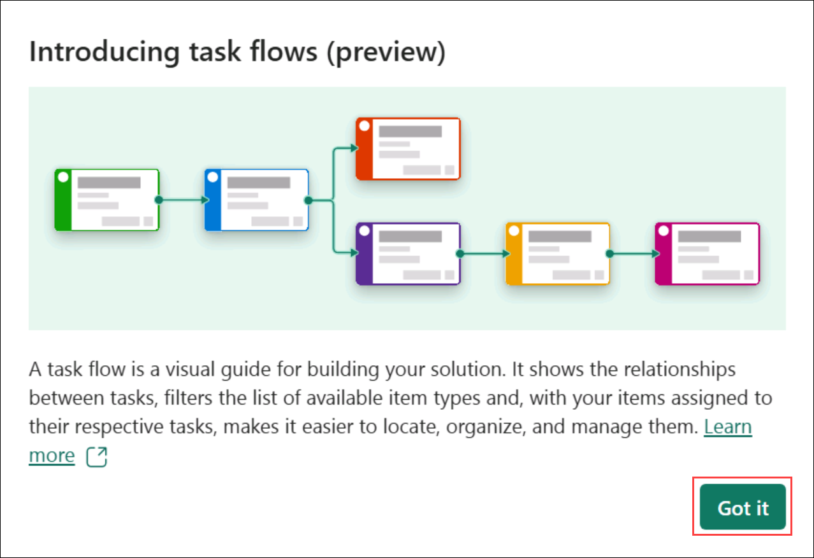

# Lab 1 - Getting started

This lab will cover:

- Logging into Microsoft Fabric
- Creating a workspace

### 1.1 - Logging into Microsoft Fabric

1. Open your web browser and navigate to ++https://fabric.microsoft.com++.

1. In the **Email** box, enter **++@lab.CloudPortalCredential(User1).Username++**. Select **Submit**.

    

1. On the **Enter Temporary Access Pass** dialog, enter **++@lab.CloudPortalCredential(User1).TAP++**. Select **Sign in**.

    

1. On the **Stay signed in?** dialog, check the box next to **Don't show this again**. Select **Yes**.

    

1. Dismiss the **Welcome to the Fabric view** tour by selecting **Cancel**.

    

### 1.2 - Creating a workspace

1. From the left navigation bar, select **Workspaces** then select **+ New workspace**.

    *Note: The icons on the navigation bar can be pinned and unpinned. Therefore, the icons you see may differ from the screenshot.*

    

1. In the **Create a workspace** pane, in the **Name** box, enter **++@lab.CloudResourceTemplate(FabricPerUserPOCv3).Parameters[capacityName]++** (the trailing numbers should be unique to each lab user). Select **Apply** to create and open the new workspace.

    

1. Dismiss the **Introducing task flows** dialog by selecting **Got it**.
    
    

## Next steps
In this lab you configured your environment which includes a workspace and a capacity. This is the foundational infrastructure for the remaining labs. You are now ready to get started learning how to unify data, act on insights, and build AI solutions with Microsoft Fabric!

- Select **Next** to continue to **Lab 2 - Lakehouses and Data Engineering with Spark**
- Select **Previous** to return to the **Introduction**

## Additional Resources
- [Getting started with Microsoft Fabric](https://www.microsoft.com/en-us/microsoft-fabric/getting-started)
- [Enable Microsoft Fabric for your organization](https://learn.microsoft.com/en-us/fabric/admin/fabric-switch)
- [Fabric region availability](https://learn.microsoft.com/en-us/fabric/admin/region-availability)
- [Microsoft Fabric concepts and licenses](https://learn.microsoft.com/en-us/fabric/enterprise/licenses)
- [Microsoft Fabric trial capacity](https://learn.microsoft.com/en-us/fabric/fundamentals/fabric-trial)
