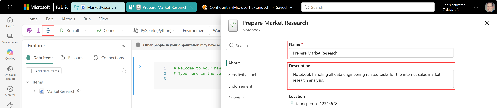
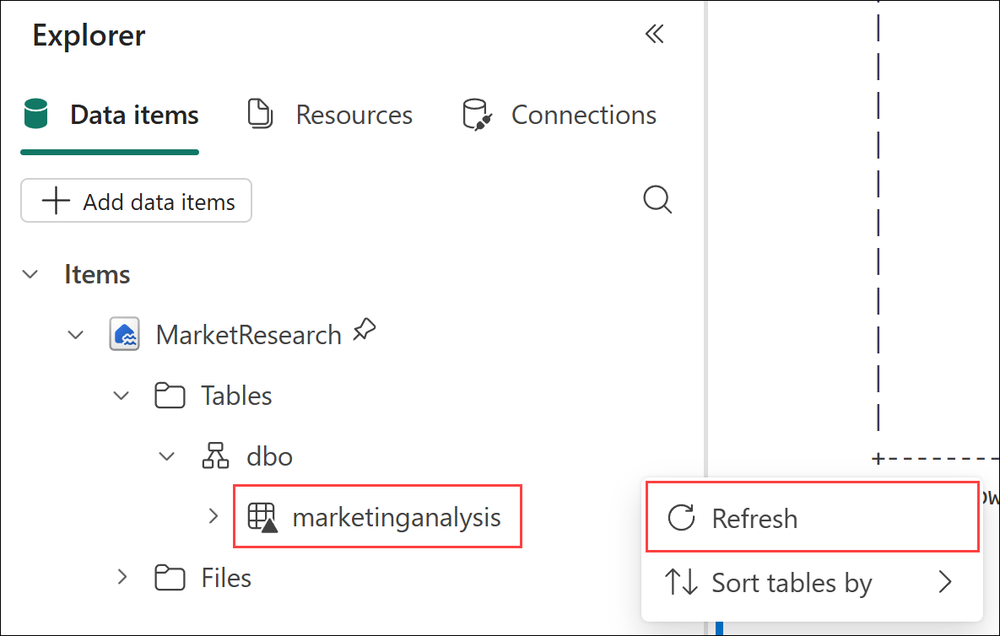
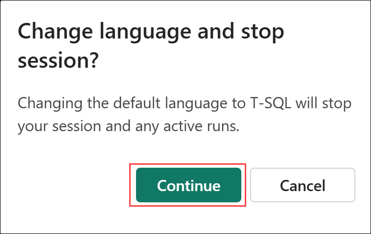
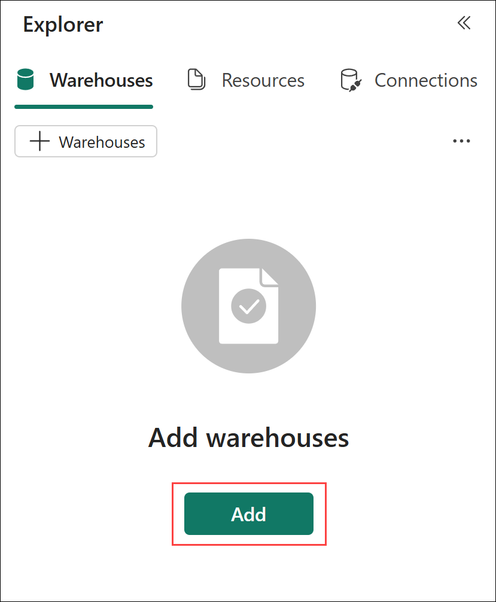
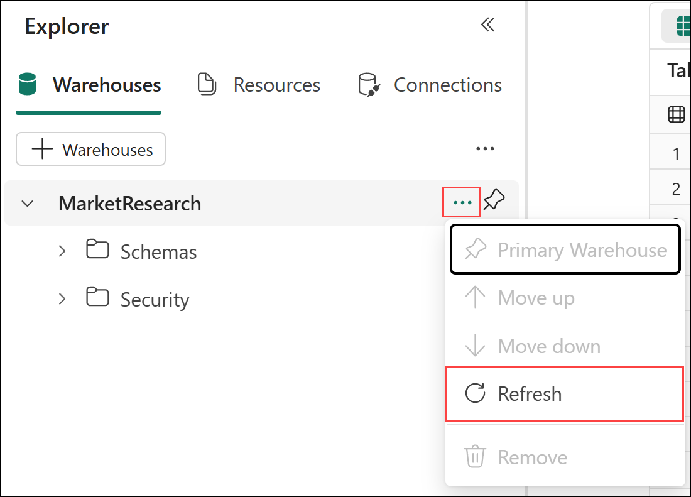
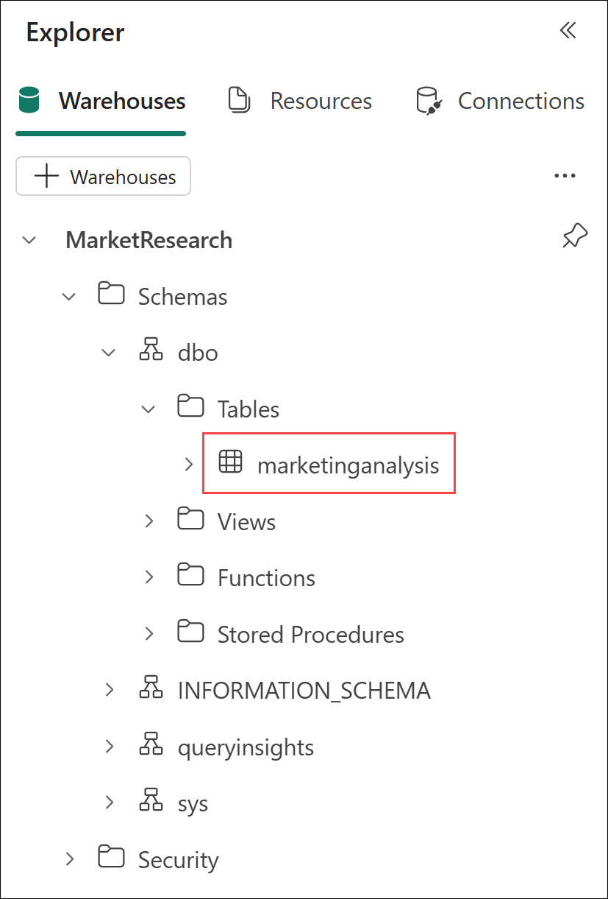

# Lab 2 - Lakehouses and Data Engineering with Spark

Before you begin:

- If you have not completed Lab 1 - Getting started, go complete all the steps then return here to continue.

This lab will cover:

- Creating a lakehouse
- Extract, Transform, and Load data with PySpark
- Querying tables with T-SQL

<hr>

### 2.1 - Creating a lakehouse

1. If necessary, return to the *@lab.CloudResourceTemplate(FabricPerUserPOCv3).Parameters[capacityName]* workspace created in *Lab 1 - Getting started* by selecting the **workspace icon** from the left navigation bar then selecting your workspace name from the flyout. 

    *Note: The icons on the navigation bar can be pinned and unpinned. Therefore, the icons you see may differ from the screenshot.*

    

1. With the empty Fabric workspace open, select **New item** located just below the workspace name.

    

1. From the **All items** view, locate the **Store data** section and select the **Lakehouse** tile.

    

1. On the **New Lakehouse** dialog box, enter the name **MarketResearch** and select **Create**. 

    

    The lakehouse will be created and open to the *Get data in your lakehouse* landing page with a set of links to get started quickly.

    

### 2.2 - Extract, Transform, and Load data with PySpark

1. From the **Home** tab of the ribbon, select **Open notebook -> New notebook**. An empty notebook with the default name of *Notebook 1* will be created and open.

    

1. From the **Home** tab of the ribbon, select the **gear** icon (Settings) to open the notebook settings. On the **About** page, perform the following actions:
    - Change the **Name** to **Prepare Market Research**.
    - Optionally, add a **Description** such as **Notebook handling all data engineering related tasks for the internet sales market research analysis.**.
    - Select the **X** in the top right corner of the notebook settings to return to the notebook editor.

    

1. The *Reasons.parquet* file contains a list of options for what may have influenced a customer's decision to make a purchase. The *SalesReason.parquet* file contains a record for each line item purchased and the ID for the corresponding reason that influenced the purchase. Read each file into a dataframe and preview the data by performing the following actions:
    - Replace the text in the first notebook cell with the following code:
        ```python
        df_salesreason = spark.read.parquet("abfss://sampledata@scbradlstorage01.dfs.core.windows.net/Ignite/SalesReason.parquet")
        df_reasons = spark.read.parquet("abfss://sampledata@scbradlstorage01.dfs.core.windows.net/Ignite/Reasons.parquet")
        df_salesreason.show()
        df_reasons.show()
        ```
    - Select the **Play** button (Run cell) or press **CRTL + ENTER** with the first code cell in focus to run the code.
    - Review both datasets.

    

1. Scroll past the dataframe output to the bottom of the notebook. Hover the mouse just below the bottom of the cell output. Two options will appear: *+ Cell* and *+ Markdown*. Select **+ Cell** to add a new code cell to the notebook. 

    

1. In the blank code cell:
    - Enter the code below which:
        - Joins the **df_salesreason** and **df_reason** dataframes together to form the **df_marketinganalysis** dataframe using a left outer join.
        - Drops the SalesReasonID field from the dataset. 
        - Shows the df_marketinganalysis dataframe for validation. 

        ```python
        df_marketinganalysis = df_salesreason.join(df_reasons, "SalesReasonID", "leftouter").drop("SalesReasonID")
        df_marketinganalysis.show()
        ```
    - Select the **Play** button (Run cell) or press **CRTL + ENTER** with the cell in focus to run the code.
    - Review the dataset.

    

1. Scroll past the dataframe output to the bottom of the notebook. Hover the mouse just below the bottom of the cell output. Two options will appear: *+ Cell* and *+ Markdown*. Select **+ Cell** to add a new code cell to the notebook. 

1. In the blank code cell:
    - Enter the code below which writes the dataframe to a Delta table.

        ```python
        df_marketinganalysis = df_salesreason.join(df_reasons, "SalesReasonID", "leftouter").drop("SalesReasonID")
        df_marketinganalysis.show()
        ```

    - Select the **Play** button (Run cell) or press **CRTL + ENTER** with the cell in focus to run the code.
    - There will be no output from the cell upon successful completion.

    

1. In the **Explorer**, expand **MarketResearch** -> **Tables** and select the ellipsis (**...**) next to **dbo**. From the menu, select **Refresh**. Validate that the **marketinganalysis** table appears in the list. 

    

1. Scroll past the dataframe output to the bottom of the notebook. Hover the mouse just below the bottom of the cell output. Two options will appear: *+ Cell* and *+ Markdown*. Select **+ Cell** to add a new code cell to the notebook. 

1. In the blank code cell:
    - Enter the code below which uses Spark SQL to read from the Delta table created in a previous step.

        ```sql
        %%sql
        SELECT * FROM marketinganalysis LIMIT 10
        ```

    - Select the **Play** button (Run cell) or press **CRTL + ENTER** with the cell in focus to run the code.

    - Review the results and compare them to the dataframe output from the previous steps.

    

### 2.3 - Querying tables with T-SQL

1. From the **Home** tab of the ribbon, open the *Language* dropdown by selecting the down arrow next to **PySpark (Python)**. From the menu, select **T-SQL** from the *T-SQL Analytics*.

    

1. If there is an active Spark session, you will be prompted to stop the session. Select **Continue**. If no Spark session is active, the language change will take effect immediately without any prompts.

    

1. In the **Explorer**, select the **Add** button. 

    

1. On the warehouse selection page, check the box next to the **MarketResearch** item. The *Type* will be listed as *SQL analytics endpoint*. Select **Confirm**.

    

1. In the **Explorer**, select the ellipsis (**...**) next to the **MarketResearch** SQL analytics endpoint. From the menu, select **Refresh**.

    

1. In the **Explorer**, expand **MarketResearch** -> **Schemas** -> **dbo** -> **Tables** and verify the **marketinganalysis** table exists. 

    

1. In the notebook, scroll past the Spark SQL output to the bottom of the notebook. Hover the mouse just below the bottom of the cell output. Two options will appear: *+ Cell* and *+ Markdown*. Select **+ Cell** to add a new code cell to the notebook. Notice this time, the cell language is **T-SQL**. 

    

1. In the blank code cell:
    - Enter the code below which uses T-SQL to read from the Delta table created in a previous step. This time, the query is running using the SQL engine with the SQL analytics endpoint rather than using the Spark engine with Spark SQL.

        ```sql
        SELECT TOP 10 * FROM marketinganalysis
        ```

    - Select the **Play** button (Run cell) or press **CRTL + ENTER** with the cell in focus to run the code.

    - Review the results and compare them to the Spark SQL output from the previous cell.

    


## Next steps
In this lab you created a new lakehouse, extracted data from multiple Parquet files, transformed the data, and write it to a Delta in the lakehouse using PySpark. Then, you connected to the lakehouse's SQL analytics endpoint to run a T-SQL query similar to what an analyst may do and how Fabric data agents will interact with the lakehouse. 

- Select **Next** to continue to **Lab 3 - Dimensional Modeling with Data Warehouse**
- Select **Previous** to return to **Lab 1 - Getting started**

## Additional Resources
- [What is a lakehouse in Microsoft Fabric?](https://learn.microsoft.com/en-us/fabric/data-engineering/lakehouse-overview)
- [Lakehouse and Delta Lake tables](https://learn.microsoft.com/en-us/fabric/data-engineering/lakehouse-and-delta-tables)
- [Develop, execute, and manage Microsoft Fabric notebooks](https://learn.microsoft.com/en-us/fabric/data-engineering/author-execute-notebook)
- [How to use Microsoft Fabric notebooks](https://learn.microsoft.com/en-us/fabric/data-engineering/how-to-use-notebook)
- [Use a notebook to load data into your lakehouse](https://learn.microsoft.com/en-us/fabric/data-engineering/lakehouse-notebook-load-data)
