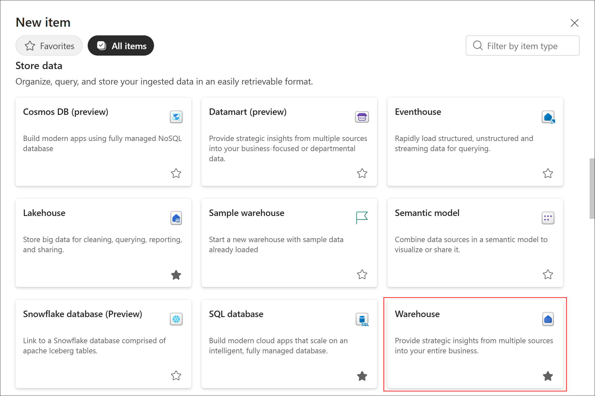
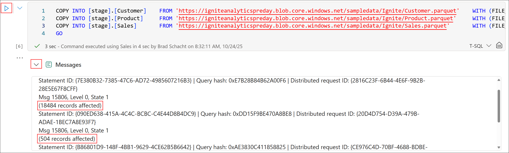
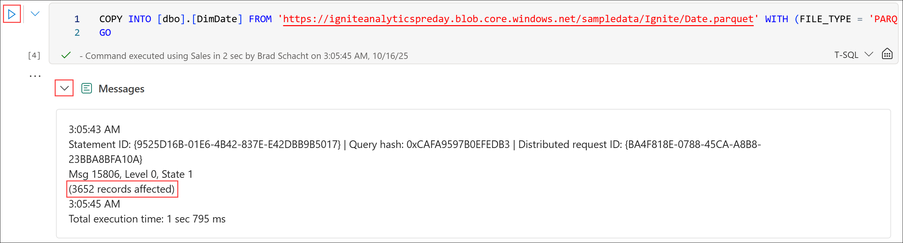
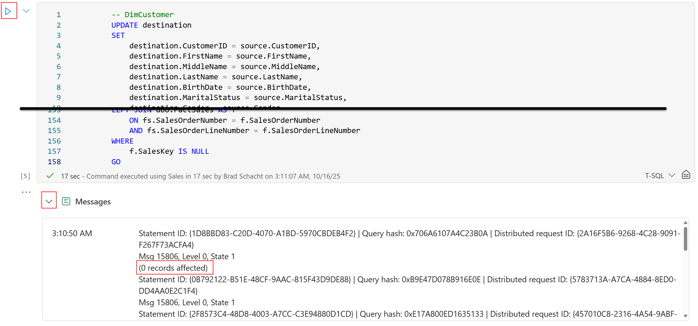

# Lab 3 - Dimensional Modeling with Data Warehouse

Before you begin:

- If you have not completed Lab 2 - Lakehouses and Data Engineering with Spark, go complete all the steps then return here to continue.

This lab will cover:

- Creating a data warehouse
- Creating schemas and loading data with T-SQL
- Transforming data and creating a dimensional model

<hr>

### 3.1 - Creating a data warehouse

1. If necessary, return to the *@lab.CloudResourceTemplate(FabricPerUserPOCv3).Parameters[capacityName]* workspace created in *Lab 1 - Getting started* by selecting the **workspace icon** from the left navigation bar then selecting your workspace name from the flyout. 

    *Note: The icons on the navigation bar can be pinned and unpinned. Therefore, the icons you see may differ from the screenshot.*

    

1. With the Fabric workspace open, select **New item** located just below the workspace name.

    

1. From the **All items** view, locate the **Store data** section and select the **Warehouse** tile.

    

1. On the **New warehouse** dialog box, enter the name **++Sales++** and select **Create**. 

    

    The warehouse will be created and open to the *Build a warehouse* landing page with a set of links to get started quickly.

    

### 3.2 - Creating schemas and loading data with T-SQL

1. From the **Home** tab of the ribbon, select the **down arrow** next to **New SQL query** then select **New SQL query in notebook**. An empty notebook with the default name of *Notebook 1* will be created and open. *Note: If you select New SQL query instead of the down arrow next to the text a new query window will be opened, not a notebook.*

    

1. From the **Home** tab of the ribbon, select the **gear** icon (Settings) to open the notebook settings. On the **About** page, perform the following actions:
    - Change the **Name** to **++Build Dimensional Model++**.
    - Optionally, add a **Description** such as **++Notebook handling all data engineering related tasks for the internet sales data warehouse.++**.
    - Select the **X** in the top right corner of the notebook settings to return to the notebook editor.

    

1. In the blank code cell perform the following actions:
    - Enter the code:

        ```sql
        IF NOT EXISTS (SELECT * FROM [sys].[schemas] WHERE name = 'stage')
        EXEC('CREATE SCHEMA stage')
        GO

        DROP TABLE IF EXISTS [stage].[Customer]
        DROP TABLE IF EXISTS [stage].[Product]
        DROP TABLE IF EXISTS [stage].[Sales]
        GO

        CREATE TABLE [stage].[Customer]
            (
                [CustomerID]            [varchar](15),
                [FirstName]             [varchar](50),
                [MiddleName]            [varchar](50),
                [LastName]              [varchar](50),
                [BirthDate]             [date],
                [MaritalStatus]         [char](1),
                [Gender]                [varchar](1),
                [EmailAddress]          [varchar](50),
                [YearlyIncome]          [decimal](38,18),
                [TotalChildren]         [smallint],
                [NumberChildrenAtHome]  [smallint],
                [Education]             [varchar](40),
                [Occupation]            [varchar](100),
                [HouseOwnerFlag]        [char](1),
                [NumberCarsOwned]       [smallint],
                [AddressLine1]          [varchar](120),
                [AddressLine2]          [varchar](120),
                [City]                  [varchar](120),
                [StateProvinceName]     [varchar](120),
                [CountryRegionName]     [varchar](120),
                [Phone]                 [varchar](20),
                [DateFirstPurchase]     [date],
                [CommuteDistance]       [varchar](15)
            )
        GO

        CREATE TABLE [stage].[Product]
            (
                [ProductID]             [varchar](25),
                [ProductSubcategory]    [varchar](50),
                [ProductCategory]       [varchar](50),
                [WeightUnitMeasureCode] [char](3),
                [SizeUnitMeasureCode]   [char](3),
                [ProductName]           [varchar](50),
                [StandardCost]          [decimal](38,18),
                [FinishedGoodsFlag]     [bit],
                [Color]                 [varchar](15),
                [SafetyStockLevel]      [smallint],
                [ReorderPoint]          [smallint],
                [ListPrice]             [decimal](38,18),
                [Size]                  [varchar](50),
                [SizeRange]             [varchar](50),
                [Weight]                [float],
                [DaysToManufacture]     [int],
                [ProductLine]           [char](2),
                [DealerPrice]           [decimal](38,18),
                [Class]                 [char](2),
                [Style]                 [char](2),
                [ModelName]             [varchar](50),
                [Description]           [varchar](400)
            )
        GO

        CREATE TABLE [stage].[Sales]
            (
                [ProductID]             [varchar](25),
                [OrderDate]             [date],
                [DueDate]               [date],
                [ShipDate]              [date],
                [CustomerID]            [varchar](15),
                [SalesOrderNumber]      [varchar](20),
                [SalesOrderLineNumber]  [smallint],
                [OrderQuantity]         [smallint],
                [UnitPrice]             [decimal](38,18),
                [ExtendedAmount]        [decimal](38,18),
                [UnitPriceDiscountPct]  [float],
                [DiscountAmount]        [float],
                [ProductStandardCost]   [decimal](38,18),
                [TotalProductCost]      [decimal](38,18),
                [SalesAmount]           [decimal](38,18),
                [TaxAmt]                [decimal](38,18),
                [Freight]               [decimal](38,18),
                [CarrierTrackingNumber] [varchar](25),
                [CustomerPONumber]      [varchar](25)
            )
        GO
        ```
    - Select the **Play** button (Run cell) located just outside the top left of the cell or press **CRTL + ENTER** with the cell in focus to run the code.
    - There will be no results for this query, only a collapsed messages output.

    

1. In the **Explorer**, perform the following actions:

    ***Note:*** *It can take several minutes for new objects to show up in the object explorer even though they have been created. If the tables do not show up after selecting refresh in the steps below, wait 2 minutes and try again. This step is NOT required to continue and complete the rest of the lab.*
    
    - Select the ellipsis (**...**) next to **Sales**. From the menu, select **Refresh**.

    

    - Expand the object tree to **Sales** -> **Schemas** -> **stage** -> **Tables**.

    - Select the ellipsis (**...**) next to **Tables**. From the menu, select **Refresh**.

    
    
    - Expand **Tables** and validate the the three tables were create:
        - Customer
        - Product
        - Sales

    

1. Scroll past the output to the bottom of the notebook. Hover the mouse just below the bottom of the cell output. Two options will appear: *+ Code* and *+ Markdown*. Select **+ Code** to add a new code cell to the notebook. 

    

1. In the blank code cell perform the following actions:
    - Enter the code below:
        ```sql
        COPY INTO [stage].[Customer]    FROM 'https://igniteanalyticspreday.blob.core.windows.net/sampledata/Ignite/Customer.parquet'    WITH (FILE_TYPE = 'PARQUET');
        COPY INTO [stage].[Product]     FROM 'https://igniteanalyticspreday.blob.core.windows.net/sampledata/Ignite/Product.parquet'     WITH (FILE_TYPE = 'PARQUET');
        COPY INTO [stage].[Sales]       FROM 'https://igniteanalyticspreday.blob.core.windows.net/sampledata/Ignite/Sales.parquet'       WITH (FILE_TYPE = 'PARQUET');
        GO
        ```

    - Select the **Play** button (Run cell) or press **CRTL + ENTER** with the cell in focus to run the code.

    - There will be no results for this query, only a collapsed messages output. Expand the output and verify the record counts by selecting the **down arrow** next to the word **Messages** below the code cell.

        - **stage.Customer**: 18,484 
        - **stage.Product**: 504
        - **stage.Sales**: 60,398

    

### 3.3 - Transforming data and creating a dimensional model

1. Scroll to the bottom of the notebook. Hover the mouse just below the bottom of the cell output. Two options will appear: *+ Code* and *+ Markdown*. Select **+ Code** to add a new code cell to the notebook. 

1. In the blank code cell perform the following actions:
    - Enter the code:

        ```sql
        DROP TABLE IF EXISTS [dbo].[DimCustomer]
        DROP TABLE IF EXISTS [dbo].[DimDate]
        DROP TABLE IF EXISTS [dbo].[DimProduct]
        DROP TABLE IF EXISTS [dbo].[FactSales]
        GO

        CREATE TABLE [dbo].[DimCustomer]
            (
                [CustomerKey]           [int]             NOT NULL,
                [CustomerID]            [varchar](15)     NOT NULL,
                [FirstName]             [varchar](50)     NULL,
                [MiddleName]            [varchar](50)     NULL,
                [LastName]              [varchar](50)     NULL,
                [BirthDate]             [date]            NULL,
                [MaritalStatus]         [char](1)         NULL,
                [Gender]                [varchar](1)      NULL,
                [EmailAddress]          [varchar](50)     NULL,
                [YearlyIncome]          [decimal](38,18)  NULL,
                [TotalChildren]         [smallint]        NULL,
                [NumberChildrenAtHome]  [smallint]        NULL,
                [Education]             [varchar](40)     NULL,
                [Occupation]            [varchar](100)    NULL,
                [HouseOwnerFlag]        [char](1)         NULL,
                [NumberCarsOwned]       [smallint]        NULL,
                [AddressLine1]          [varchar](120)    NULL,
                [AddressLine2]          [varchar](120)    NULL,
                [City]                  [varchar](120)    NULL,
                [StateProvinceName]     [varchar](120)    NULL,
                [CountryRegionName]     [varchar](120)    NULL,
                [Phone]                 [varchar](20)     NULL,
                [DateFirstPurchase]     [date]            NULL,
                [CommuteDistance]       [varchar](15)     NULL
            )
        GO

        CREATE TABLE [dbo].[DimDate]
            (
                [DateKey]               [int]             NOT NULL,
                [FullDate]              [date]            NOT NULL,
                [DayNumberOfWeek]       [smallint]        NOT NULL,
                [DayNameOfWeek]         [varchar](10)     NOT NULL,
                [DayNumberOfMonth]      [smallint]        NOT NULL,
                [DayNumberOfYear]       [smallint]        NOT NULL,
                [WeekNumberOfYear]      [smallint]        NOT NULL,
                [MonthName]             [varchar](10)     NOT NULL,
                [MonthNumberOfYear]     [smallint]        NOT NULL,
                [CalendarQuarter]       [smallint]        NOT NULL,
                [CalendarYear]          [smallint]        NOT NULL,
                [CalendarSemester]      [smallint]        NOT NULL,
                [FiscalQuarter]         [smallint]        NOT NULL,
                [FiscalYear]            [smallint]        NOT NULL,
                [FiscalSemester]        [smallint]        NOT NULL
            )
        GO

        CREATE TABLE [dbo].[DimProduct]
            (
                [ProductKey]            [int]             NULL,
                [ProductID]             [varchar](25)     NULL,
                [ProductSubcategory]    [varchar](50)     NULL,
                [ProductCategory]       [varchar](50)     NULL,
                [WeightUnitMeasureCode] [char](3)         NULL,
                [SizeUnitMeasureCode]   [char](3)         NULL,
                [ProductName]           [varchar](50)     NULL,
                [StandardCost]          [decimal](38,18)  NULL,
                [FinishedGoodsFlag]     [bit]             NOT NULL,
                [Color]                 [varchar](15)     NOT NULL,
                [SafetyStockLevel]      [smallint]        NULL,
                [ReorderPoint]          [smallint]        NULL,
                [ListPrice]             [decimal](38,18)  NULL,
                [Size]                  [varchar](50)     NULL,
                [SizeRange]             [varchar](50)     NULL,
                [Weight]                [float]           NULL,
                [DaysToManufacture]     [int]             NULL,
                [ProductLine]           [char](2)         NULL,
                [DealerPrice]           [decimal](38,18)  NULL,
                [Class]                 [char](2)         NULL,
                [Style]                 [char](2)         NULL,
                [ModelName]             [varchar](50)     NULL,
                [Description]           [varchar](400)    NULL
            )
        GO

        CREATE TABLE [dbo].[FactSales]
            (
                [SalesKey]              [int]             NOT NULL,
                [ProductKey]            [int]             NOT NULL,
                [OrderDateKey]          [int]             NOT NULL,
                [DueDateKey]            [int]             NOT NULL,
                [ShipDateKey]           [int]             NOT NULL,
                [CustomerKey]           [int]             NOT NULL,
                [SalesOrderNumber]      [varchar](20)     NOT NULL,
                [SalesOrderLineNumber]  [smallint]        NOT NULL,
                [OrderQuantity]         [smallint]        NOT NULL,
                [UnitPrice]             [decimal](38,18)  NOT NULL,
                [ExtendedAmount]        [decimal](38,18)  NOT NULL,
                [UnitPriceDiscountPct]  [float]           NOT NULL,
                [DiscountAmount]        [float]           NOT NULL,
                [ProductStandardCost]   [decimal](38,18)  NOT NULL,
                [TotalProductCost]      [decimal](38,18)  NOT NULL,
                [SalesAmount]           [decimal](38,18)  NOT NULL,
                [TaxAmt]                [decimal](38,18)  NOT NULL,
                [Freight]               [decimal](38,18)  NOT NULL,
                [CarrierTrackingNumber] [varchar](25)     NULL,
                [CustomerPONumber]      [varchar](25)     NULL
            )
        GO
        ```
    - Select the **Play** button (Run cell) located just outside the top left of the cell or press **CRTL + ENTER** with the cell in focus to run the code.
    - There will be no results for this query, only a collapsed messages output.

    

1. In the **Explorer**, perform the following actions:

    - Expand the object tree to **Sales** -> **Schemas** -> **dbo** -> **Tables**.

    - Select the ellipsis (**...**) next to **Tables**. From the menu, select **Refresh**.

    
    
    - Expand **Tables** and validate the the four tables were create:
        - DimCustomer
        - DimDate
        - DimProduct
        - FactSales

    

1. Scroll to the bottom of the notebook. Hover the mouse just below the bottom of the cell output. Two options will appear: *+ Code* and *+ Markdown*. Select **+ Code** to add a new code cell to the notebook. 

1. In the blank code cell perform the following actions:
    - Enter the code below:
        ```sql
        COPY INTO [dbo].[DimDate] FROM 'https://igniteanalyticspreday.blob.core.windows.net/sampledata/Ignite/Date.parquet' WITH (FILE_TYPE = 'PARQUET');
        GO
        ```

    - Select the **Play** button (Run cell) or press **CRTL + ENTER** with the cell in focus to run the code.

    - There will be no results for this query, only a collapsed messages output. Expand the output and verify the record count by selecting the **down arrow** next to the word **Messages** below the code cell.

        - **dbo.DimDate**: 3,652

    

1. Scroll to the bottom of the notebook. Hover the mouse just below the bottom of the cell output. Two options will appear: *+ Code* and *+ Markdown*. Select **+ Code** to add a new code cell to the notebook. 

1. In the blank code cell perform the following actions:
    - Enter the code below:
        ```sql
        -- DimCustomer
        UPDATE destination
        SET 
            destination.CustomerID              = source.CustomerID, 
            destination.FirstName               = source.FirstName, 
            destination.MiddleName              = source.MiddleName, 
            destination.LastName                = source.LastName, 
            destination.BirthDate               = source.BirthDate, 
            destination.MaritalStatus           = source.MaritalStatus, 
            destination.Gender                  = source.Gender, 
            destination.EmailAddress            = source.EmailAddress, 
            destination.YearlyIncome            = source.YearlyIncome, 
            destination.TotalChildren           = source.TotalChildren, 
            destination.NumberChildrenAtHome    = source.NumberChildrenAtHome, 
            destination.Education               = source.Education, 
            destination.Occupation              = source.Occupation, 
            destination.HouseOwnerFlag          = source.HouseOwnerFlag, 
            destination.NumberCarsOwned         = source.NumberCarsOwned, 
            destination.AddressLine1            = source.AddressLine1, 
            destination.AddressLine2            = source.AddressLine2, 
            destination.City                    = source.City, 
            destination.StateProvinceName       = source.StateProvinceName, 
            destination.CountryRegionName       = source.CountryRegionName, 
            destination.Phone                   = source.Phone, 
            destination.DateFirstPurchase       = source.DateFirstPurchase, 
            destination.CommuteDistance         = source.CommuteDistance
        FROM dbo.DimCustomer AS destination
        INNER JOIN stage.Customer AS source
            ON destination.CustomerID = source.CustomerID

        DECLARE @MaxID INT = (SELECT ISNULL(MAX(CustomerKey), 0) FROM dbo.DimCustomer)

        INSERT INTO dbo.DimCustomer
        SELECT
            @MaxID + ROW_NUMBER() OVER(ORDER BY (SELECT NULL)) AS CustomerKey,
            CustomerID,
            FirstName,
            MiddleName,
            LastName,
            BirthDate,
            MaritalStatus,
            Gender,
            EmailAddress,
            YearlyIncome,
            TotalChildren,
            NumberChildrenAtHome,
            Education,
            Occupation,
            HouseOwnerFlag,
            NumberCarsOwned,
            AddressLine1,
            AddressLine2,
            City,
            StateProvinceName,
            CountryRegionName,
            Phone,
            DateFirstPurchase,
            CommuteDistance
        FROM stage.Customer
        WHERE CustomerID NOT IN (SELECT CustomerID FROM dbo.DimCustomer)
        GO

        -- DimProduct
        UPDATE destination
        SET 
            destination.ProductID               = source.ProductID, 
            destination.ProductSubcategory      = source.ProductSubcategory, 
            destination.ProductCategory         = source.ProductCategory, 
            destination.WeightUnitMeasureCode   = source.WeightUnitMeasureCode, 
            destination.SizeUnitMeasureCode     = source.SizeUnitMeasureCode, 
            destination.ProductName             = source.ProductName, 
            destination.StandardCost            = source.StandardCost, 
            destination.FinishedGoodsFlag       = source.FinishedGoodsFlag, 
            destination.Color                   = source.Color, 
            destination.SafetyStockLevel        = source.SafetyStockLevel, 
            destination.ReorderPoint            = source.ReorderPoint, 
            destination.ListPrice               = source.ListPrice, 
            destination.Size                    = source.Size, 
            destination.SizeRange               = source.SizeRange, 
            destination.Weight                  = source.Weight, 
            destination.DaysToManufacture       = source.DaysToManufacture, 
            destination.ProductLine             = source.ProductLine, 
            destination.DealerPrice             = source.DealerPrice, 
            destination.Class                   = source.Class, 
            destination.Style                   = source.Style, 
            destination.ModelName               = source.ModelName, 
            destination.Description             = source.Description
        FROM dbo.DimProduct AS destination
        INNER JOIN stage.Product AS source
            ON destination.ProductID = source.ProductID

        DECLARE @MaxID INT = (SELECT ISNULL(MAX(ProductKey), 0) FROM dbo.DimProduct)

        INSERT INTO dbo.DimProduct
        SELECT
            @MaxID + ROW_NUMBER() OVER(ORDER BY (SELECT NULL)) AS ProductKey,
            ProductID,
            ProductSubcategory,
            ProductCategory,
            WeightUnitMeasureCode,
            SizeUnitMeasureCode,
            ProductName,
            StandardCost,
            FinishedGoodsFlag,
            Color,
            SafetyStockLevel,
            ReorderPoint,
            ListPrice,
            Size,
            SizeRange,
            Weight,
            DaysToManufacture,
            ProductLine,
            DealerPrice,
            Class,
            Style,
            ModelName,
            Description
        FROM stage.Product
        WHERE ProductID NOT IN (SELECT ProductID FROM dbo.DimProduct)
        GO

        -- Fact Sales
        DECLARE @MaxID BIGINT = (SELECT ISNULL(MAX(SalesKey), 0) FROM dbo.FactSales)

        INSERT INTO dbo.FactSales
        SELECT
            @MaxID + ROW_NUMBER() OVER(ORDER BY (SELECT NULL)) AS SalesKey,
            dp.[ProductKey],
            dod.[DateKey] AS [OrderDateKey],
            ddd.[DateKey] AS [DueDateKey],
            dsd.[DateKey] AS [ShipDateKey],
            dc.[CustomerKey],
            fs.[SalesOrderNumber],
            fs.[SalesOrderLineNumber],
            fs.[OrderQuantity],
            fs.[UnitPrice],
            fs.[ExtendedAmount],
            fs.[UnitPriceDiscountPct],
            fs.[DiscountAmount],
            fs.[ProductStandardCost],
            fs.[TotalProductCost],
            fs.[SalesAmount],
            fs.[TaxAmt],
            fs.[Freight],
            fs.[CarrierTrackingNumber],
            fs.[CustomerPONumber]
        FROM stage.Sales AS fs
        LEFT JOIN dbo.DimCustomer AS dc
            ON fs.CustomerID = dc.CustomerID
        LEFT JOIN dbo.DimProduct AS dp
            ON fs.ProductID = dp.ProductID
        LEFT JOIN dbo.DimDate AS dod
            ON fs.OrderDate = dod.FullDate
        LEFT JOIN dbo.DimDate AS ddd
            ON fs.DueDate = ddd.FullDate
        LEFT JOIN dbo.DimDate dsd
            ON fs.ShipDate = dsd.FullDate
        LEFT JOIN dbo.FactSales AS f
            ON fs.SalesOrderNumber = f.SalesOrderNumber
            AND fs.SalesOrderLineNumber = f.SalesOrderLineNumber
        WHERE
            f.SalesKey IS NULL
        GO
        ```

    - Select the **Play** button (Run cell) or press **CRTL + ENTER** with the cell in focus to run the code.

    - There will be no results for this query, only a collapsed messages output. Expand the output and verify the record counts by selecting the **down arrow** next to the word **Messages** below the code cell.

        - **dbo.DimCustomer** (Updates): 0
        - **dbo.DimCustomer** (Inserts): 18,484
        - **dbo.DimProduct** (Updates): 0
        - **dbo.DimProduct** (Inserts): 504
        - **dbo.FactSales** (Inserts): 60,398

    

1. Optionally, rerun the last cell in the notebook again. This time when the code runs it should update all the records and insert no new records. This shows the incremental load logic is working as expected and reruns of the ETL would not cause duplicate data. Verify the record counts below and notice the similarities and differences from the first time this code was run. 

    - **dbo.DimCustomer** (Updates): 18,484
    - **dbo.DimCustomer** (Inserts): 0
    - **dbo.DimProduct** (Updates): 504
    - **dbo.DimProduct** (Inserts): 0
    - **dbo.FactSales** (Inserts): 0

1. Scroll to the bottom of the notebook. Hover the mouse just below the bottom of the cell output. Two options will appear: *+ Code* and *+ Markdown*. Select **+ Code** to add a new code cell to the notebook. 

1. In the blank code cell perform the following actions:
    - Enter the code below:
        ```sql
        SELECT
            dc.CommuteDistance,
            dd.CalendarYear,
            dp.ProductCategory,
            COUNT(*) AS SalesCount,
            SUM(fs.SalesAmount) AS TotalSalesAmount    
        FROM dbo.FactSales AS fs
        INNER JOIN dbo.DimCustomer AS dc
            ON fs.CustomerKey = dc.CustomerKey
        INNER JOIN dbo.DimProduct AS dp
            ON fs.ProductKey = dp.ProductKey
        INNER JOIN dbo.DimDate AS dd
            ON fs.OrderDateKey = dd.DateKey
        GROUP BY
            dc.CommuteDistance,
            dp.ProductCategory,
            dd.CalendarYear
        ORDER BY
            CommuteDistance,
            CalendarYear,
            TotalSalesAmount DESC
        ```

    - Select the **Play** button (Run cell) or press **CRTL + ENTER** with the cell in focus to run the code.

    - Explore the results and compare to the output below.

    

## Next steps
In this lab you created a new schema, stage, to hold all the raw data before it was transformed into the dimensional model. You also loaded data from Azure Data Lake Storage into the warehouse using the T-SQL COPY INTO command. Then, you transformed the data using T-SQL into a dimensional model ensuring warehouse keys (surrogate keys) were created so historical data can be tracked in the future.

- Select **Next** to continue to **Lab 4 - Conversational AI with Fabric Data Agents**
- Select **Previous** to return to **Lab 2 - Lakehouses and Data Engineering with Spark**

## Additional Resources
- [Tables in data warehousing in Microsoft Fabric](https://learn.microsoft.com/en-us/fabric/data-warehouse/tables)
- [Data types in Microsoft Fabric](https://learn.microsoft.com/en-us/fabric/data-warehouse/data-types)
- [Primary keys, foreign keys, and unique keys in Warehouse in Microsoft Fabric](https://learn.microsoft.com/en-us/fabric/data-warehouse/table-constraints)
- [Dimensional modeling in Microsoft Fabric Warehouse: Dimension tables](https://learn.microsoft.com/en-us/fabric/data-warehouse/dimensional-modeling-dimension-tables)
- [Dimensional modeling in Microsoft Fabric Warehouse: Fact tables](https://learn.microsoft.com/en-us/fabric/data-warehouse/dimensional-modeling-fact-tables)
- [Fabric Migration Assistant for Data Warehouse](https://learn.microsoft.com/en-us/fabric/data-warehouse/migration-assistant)
