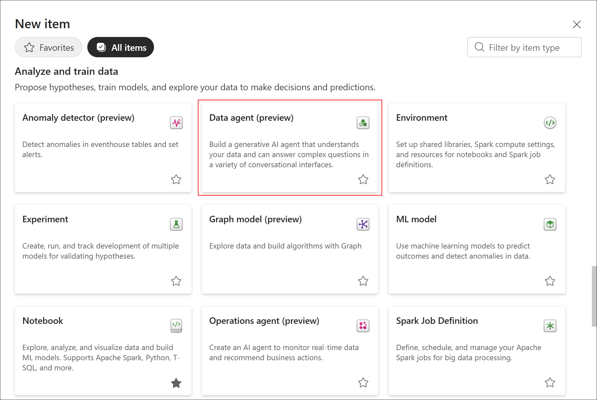
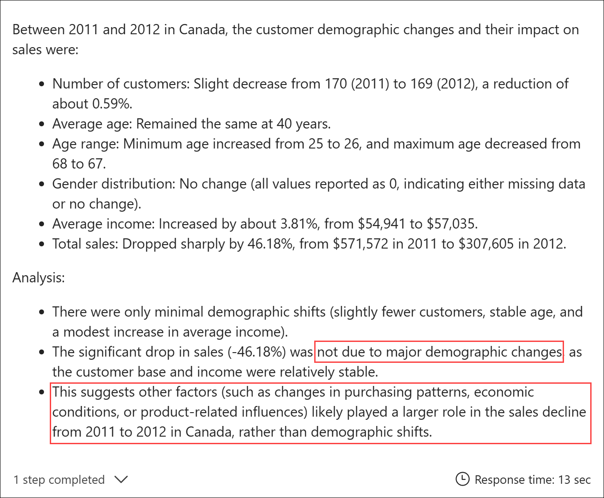
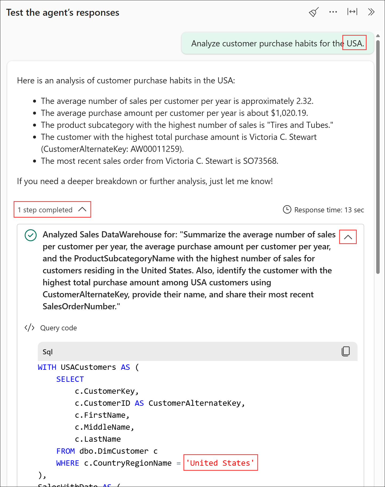
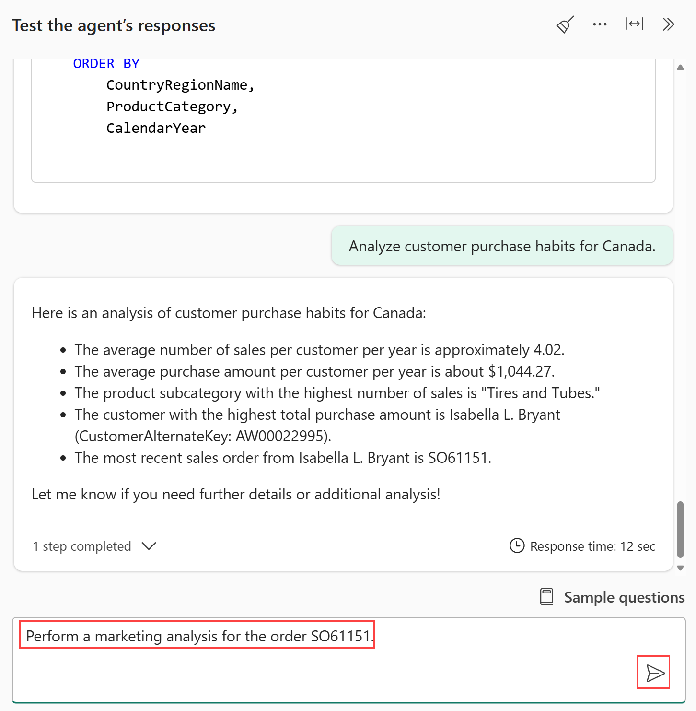

# Lab 4 - Conversational AI with Fabric Data Agents

Before you begin:

- If you have not completed Lab 3 - Dimensional Modeling with Data Warehouse, go complete all the steps then return here to continue.

This lab will cover:

- Creating a data agent
- Adding data sources to a data agent
- Configuring the data agent
- Interacting with the data agent
- Advanced agent instructions
- Publishing the data agent

<hr>

### 4.1 - Creating a data agent

1. If necessary, return to the *@lab.CloudResourceTemplate(FabricPerUserPOCv3).Parameters[capacityName]* workspace created in *Lab 1 - Getting started* by selecting the **workspace icon** from the left navigation bar then selecting your workspace name from the flyout. 

    *Note: The icons on the navigation bar can be pinned and unpinned. Therefore, the icons you see may differ from the screenshot.*

    

1. With the Fabric workspace open, select **New item** located just below the workspace name.

    

1. From the **All items** view, locate the **Analyze and train data** section and select the **Data agent (preview)** tile.

    

1. On the **Create data agent** dialog box, enter the name **++Sales Analysis Agent++** and select **Create**. 

    

    The data agent will be created and open to the *Set up your data agent* landing page with a set of instructions to get started quickly.

    

### 4.2 - Adding data sources to a data agent

1. In the **Explorer**, select **+ Data source** to add a new data source to the agent. 

    

1. On the **Add a data source** page, select the **Sales** warehouse from the item list then select **Add**.

    

1. In the **Explorer**, select the check box next to the following tables in the Sales data warehouse:

    - dbo.DimCustomer
    - dbo.DimDate
    - dbo.DimProduct
    - dbo.FactSales

    

1. In the **Explorer**, select **+ Data source** to add a new data source to the agent. 

    

1. On the **Add a data source** page, select the **MarketResearch** Lakehouse from the item list then select **Add**.

    

1. In the **Explorer**, select the check box next to the **marketinganalysis** table in the MarketResearch lakehouse.

    

### 4.3 - Configuring the data agent

1. From the **Home** tab of the ribbon, select **Agent instructions**.

    

1. In the **Agent instructions** replace the placeholder text with the following markdown to help the agent route questions to the appropriate data source then click anywhere outside the text box to apply the changes:

    ```markdown
    ## Data Sources
    When asked about **sales**, use the ```Sales``` warehouse.  
    When asked about **marketing** or **market research**, use the ```MarketResearch``` lakehouse.  
    ```

    

1. Perform the following steps to add instructions for the Sales warehouse:
    - In the **Explorer**, select **Setup**.
    - Under the **Sales** warehouse, select **Data source instructions**.
    - In the **Data source instructions**, replace the placeholder text with the following markdown to help the agent better understand context for the Sales warehouse queries:
    ```markdown
    The category "Accessories" is also commonly referred to as "Bike Accessories". Always use "Accessories".

    The United States is commonly referred to as "USA", "US", and "United States of America". Always use "United States".
    ```

    

1. Perform the following steps to add an example query to help the agent learn patterns about the sales data:
    - In the **Explorer**, select **Setup**.
    - Under the **Sales** warehouse, select **Example queries**.
    - Select **+ Add** from across the top of the example queries pane. 
    - In the **Question** box, enter: **++Show the percentage change in sales by CountryRegion and product by year and month.++**
    - In the **SQL query** box, enter the following code:

    ```sql
    SELECT
        CountryRegionName,
        ProductCategory,
        CalendarYear,
        SalesAmount,
        PreviousSalesAmount,
        CASE WHEN PreviousSalesAmount = 0 THEN NULL ELSE (SalesAmount - PreviousSalesAmount) / PreviousSalesAmount * 100 END AS PercentChange
    FROM (
        SELECT
            c.CountryRegionName,
            p.ProductCategory,
            d.CalendarYear,
            SUM(s.SalesAmount) AS SalesAmount,
            LAG(SUM(s.SalesAmount), 1,0) OVER (ORDER BY c.CountryRegionName, d.CalendarYear) AS PreviousSalesAmount
        FROM FactSales s
        FULL OUTER JOIN DimCustomer c ON s.CustomerKey = c.CustomerKey
        FULL OUTER JOIN DimDate d ON s.OrderDateKey = d.DateKey
        FULL OUTER JOIN DimProduct p ON s.ProductKey = p.ProductKey
        GROUP BY
            d.CalendarYear,
            p.ProductCategory,
            c.CountryRegionName
    ) SalesByRegionYear
    ORDER BY
        CountryRegionName,
        ProductCategory,
        CalendarYear
    ```

    - Click anywhere outside the SQL query box and the query will be validated. Invalid queries will be ignored by the agent. 

    

### 4.4 - Interacting with the data agent

1. In the **Test the agent's responses** pane, select the **Broom** icon (Clear chat).

    

1. On the **Clear chat?** dialog, select **Clear chat**.

    

1. In the **Test the agent's responses** pane, enter the question **++What kinds of influencers were there on sales by year?++** in the **chat box** then select **Send**.

    

1. Investigate the output by performing the following actions:
    - Read the response and look for any potential problems.
    - Select **1 step completed** to expand the step list. 
    - Select the **arrow** on the right side of the step to expand the step detail.
    - Notice the query uses FULL OUTER JOINs, but it should be using an INNER JOIN.

    

1. In the **Sales examples** tab, correct the **SQL query** with the code below.
    
    *Note: If the **Sales examples** tab is no longer open it can be found by navigating to the **Explorer** -> **Setup** -> **Sales** -> **Example queries**.*

    ```sql
    SELECT
        CountryRegionName,
        ProductCategory,
        CalendarYear,
        SalesAmount,
        PreviousSalesAmount,
        CASE WHEN PreviousSalesAmount = 0 THEN NULL ELSE (SalesAmount - PreviousSalesAmount) / PreviousSalesAmount * 100 END AS PercentChange
    FROM (
        SELECT
            c.CountryRegionName,
            p.ProductCategory,
            d.CalendarYear,
            SUM(s.SalesAmount) AS SalesAmount,
            LAG(SUM(s.SalesAmount), 1,0) OVER (ORDER BY c.CountryRegionName, d.CalendarYear) AS PreviousSalesAmount
        FROM FactSales s
        INNER JOIN DimCustomer c ON s.CustomerKey = c.CustomerKey
        INNER JOIN DimDate d ON s.OrderDateKey = d.DateKey
        INNER JOIN DimProduct p ON s.ProductKey = p.ProductKey
        GROUP BY
            d.CalendarYear,
            p.ProductCategory,
            c.CountryRegionName
    ) SalesByRegionYear
    ORDER BY
        CountryRegionName,
        ProductCategory,
        CalendarYear
    ```

1. In the **Test the agent's responses** pane, select the **Broom** icon (Clear chat).

    

1. On the **Clear chat?** dialog, select **Clear chat**.

1. In the **Test the agent's responses** pane, enter the question **++What kinds of influencers were there on sales by year?++** in the **chat box** then select **Send**.

    

1. Investigate the output by performing the following actions:
    - Read the response and look for any potential problems.
    - Select **1 step completed** to expand the step list. 
    - Select the **arrow** on the right side of the step to expand the step detail.
    - Notice the query now uses INNER JOINs.

    

1. In the **Test the agent's responses** pane, enter the question **++What are the trends for customers and sales by year?++** in the **chat box** then select **Send**.

    

1. In the response, notice the customer count increases year over year, but there is a drop in sales in 2012. Let's investigate this drop further. 

    *Note: Your output may look different than the screenshot.*

    

1. In the **Test the agent's responses** pane, enter the question **++Show the percentage change in sales by country from 2011 to 2012.++** in the **chat box** then select **Send**.

    

1. In the response, notice that Canada has the largest decrease from 2011 to 2012. Down about 46% year over year. Let's ask one final question to investigate the customer changes from 2011 to 2012.

    *Note: Your output may look different than the screenshot.*

    

1. In the **Test the agent's responses** pane, enter the question **++How did customer demographic change in Canada between 2011 and 2012 impact sales?++** in the **chat box** then select **Send**.

    

1. In the response, notice the demographics remained relatively constant from 2011 through 2012 suggesting other factors influenced the 46% decline in sales. Next, let's turn to the product side.

    *Note: Your output may look different than the screenshot.*

    

1. In the **Test the agent's responses** pane, enter the question **++Analyze the data to identify changes in average spend and product category mix.++** in the **chat box** then select **Send**.

    *Note: Your output may look different than the screenshot.*
    
    

1. In the response, we will see there was a significant drop in average spend per customer but no real change in the types of items being purchased with more than 99.9% of sales being bikes in 2012 vs 100% in 2012.

    *Note: Your output may look different than the screenshot.*

    

1. In the **Test the agent's responses** pane, enter the question **++Were there fewer total bikes purchased or was the average sales amount lower? Provide the average sales amount and total number purchased by subcategory of bikes.++** in the **chat box** then select **Send**.

    

1. In the response, we see there was an increase in mountain bike purchases but with a lower average purchase price. Meanwhile, road bikes declined in both quantity and average sales amount. 

    *Note: Your output may look different than the screenshot.*

    

### 4.5 Advanced agent instructions

1. From the **Home** tab of the ribbon, select **Agent instructions**.

    

1. In the **Agent instructions** add the following markdown to help the agent perform several steps each time a question is asked about customer analysis then click anywhere outside the text box to apply the changes:

    ```markdown
    ## Customer Analysis
    When asking for a **customer analysis** or to **analyze customer purchase habits** or to **explore customer purchase patterns** use the ```Sales``` warehouse to summarize the average number of sales per customer per year, the average purchase amount per customer per year, and the ProductSubcategoryName that has the highest number of sales. Then use the CustomerAlternateKey to provide the name of the customer with the highest total purchase amount. Finally, provide the most recent SalesOrderNumber from that customer.
    ```

    

1. In the **Test the agent's responses** pane, enter the question **++Analyze customer purchase habits for the USA.++** in the **chat box** then select **Send**.

    

1. Investigate the output by performing the following actions:

    - Read the response and notice it returns all the information that was added to the *Agent instructions* earlier in this section.
    - Select **1 step completed** to expand the step list.
    - Select the **arrow** on the right side of the step to expand the step detail.
    - Notice the query uses **United States** even though the question entered said **USA**. This indicates the data source instructions entered at the beginning of this module to replace US and USA references with United States are working as expected.

    *Note: Your output may look different than the screenshot.*

    

1. In the **Test the agent's responses** pane, enter the question **++Analyze customer purchase habits for Canada.++** in the **chat box** then select **Send**.

    

1. In the response, we see the same output format from the United States data but with the context of Canada applied. Make note of the most recent sales order from Isabella Bryant: SO61151. 

    *Note: Your output may look different than the screenshot.*

    

1. In the **Test the agent's responses** pane, enter the question **++Perform a marketing analysis for the order SO61151.++** in the **chat box** then select **Send**.

    

1. Investigate the output by performing the following actions:

    - Read the response and notice the driving factor behind this purchase was price.
    - Select **1 step completed** to expand the step list.
    - Select the **arrow** on the right side of the step to expand the step detail.
    - Notice the agent automatically switched data sources and is now using the **MarketResearch** lakehouse for this query as it was told to do in the *Agent instructions* earlier in this section.

    *Note: Your output may look different than the screenshot.*

    

### 4.6 Publishing the data agent

1. From the **Home** tab of the ribbon, select **Publish**.

    

1. On the **Publish data agent** dialog box, select **Publish**.

    

1. Upon completion, a notification will display indicating the agent was published successfully. 

    

## Next steps
In this lab, you created a data agent that used multiple data sources. Along the way you configured agent instructions, data source instructions, and example queries to influence the behavior of the agent. You also investigated the queries the agent was running to validate behavior and make modifications to the instructions and example queries to improve responses. 

Using the agent, we were able to quickly perform analysis to get some important details about our sales data:

- The total number of customers making purchases increased every year. 
- Despite the increase in customers, 2012 stood out due to a decline in sales. 
- The decline in sales was driven largely by Cananda followed by the United States. 
- Customer demographics stayed largely the same from 2011 to 2012. 
- There was almost no change in the quantity of bikes purchased from 2011 to 2012 (170 vs. 159). 
- The average amount per bike purchase dropped significantly in both road and mountain bikes indicating a shift in buy habits. 
- An analysis of the purchasing habits of the customer base in each country returned multiple pieces of information in a consistent format. 
- We were able to take any purchase and the agent will automatically switch to the marketing data source to help analyze the driving factor behind a purchase. 

- Select **Next** to continue to **Lab 5 - Visualizing data with Power BI**
- Select **Previous** to return to **Lab 3 - Dimensional Modeling with Data Warehouse**

## Additional Resources
- [Configure Fabric data agent tenant settings](https://learn.microsoft.com/en-us/fabric/data-science/data-agent-tenant-settings)
- [Create a Fabric data agent](https://learn.microsoft.com/en-us/fabric/data-science/how-to-create-data-agent)
- [Fabric data agent example](https://learn.microsoft.com/en-us/fabric/data-science/data-agent-end-to-end-tutorial)
- [Configure your data agent](https://learn.microsoft.com/en-us/fabric/data-science/data-agent-configurations)
- [Consume a Fabric Data Agent in Microsoft Copilot Studio](https://learn.microsoft.com/en-us/fabric/data-science/data-agent-microsoft-copilot-studio)
