# End-to-End Data Engineering:<br>Modern Data Warehousing on Microsoft Fabric

## Lab 5 - Orchestrating warehouse operations

Before you begin:

- Make sure you have read the overview on the [workshop homepage](<../README.md>).
- If you have not completed [Lab 4 - Data transformation using T-SQL](<04 - Data transformation using T-SQL.md>), go complete all the steps then return here to continue.

This lab will cover:

- <a href="#5.1">Building an orchestration pipeline</a>
- <a href="#5.2">Scheduling the pipeline</a>
- <a href="#5.3">Validating dimensional model load</a>

<hr>

<h3 id = "5.1">5.1 - Building an orchestration pipeline</h3>

1. Return to the *Modern Data Warehousing on Microsoft Fabric* workspace created in *Lab 0 - Lab environment setup* by selecting the **workspace icon** from the left navigation bar. 

    *Note: The icons on the navigation bar can be pinned and unpinned. Therefore, the icons you see may differ from the screenshot.*

    

1. Select **New item** located just below the workspace name.

    

1. From the **All items** view, locate the **Get data** section and select the **Data pipeline** tile.

    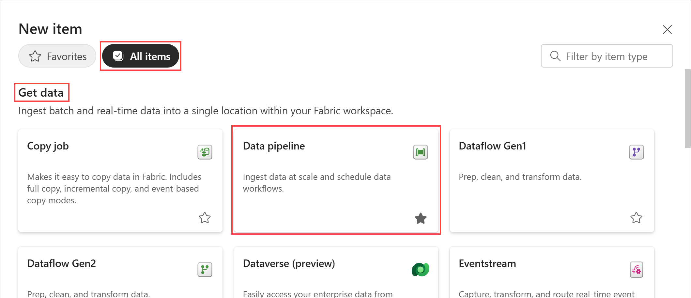

1. On the **New pipeline** dialog box, enter the name **Load Dimensional Model** and select **Create**. The pipeline will be created and open to a blank canvas with a set of links to get started quickly. 

    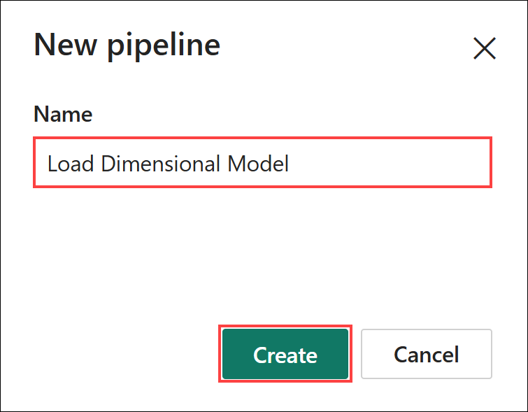

1. Select the **Pipeline activity** tile and select **Script** from the **Transform** section of the menu.

    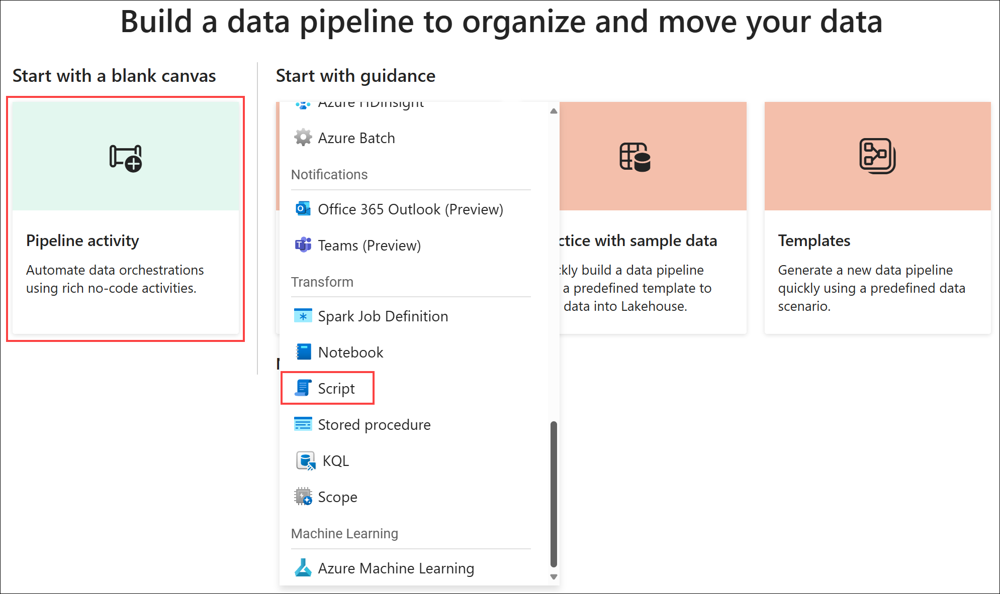

1. Select the newly created **Script1** activity on the canvas. The bottom pane will display *General* and *Settings* for the script activity.

    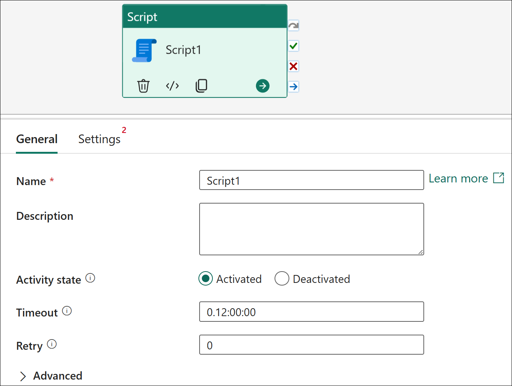

1. With the **Script1** activity still selected, on the **General** page, enter **SQL Load Stage FactSale** for the **Name** of the activity. 

    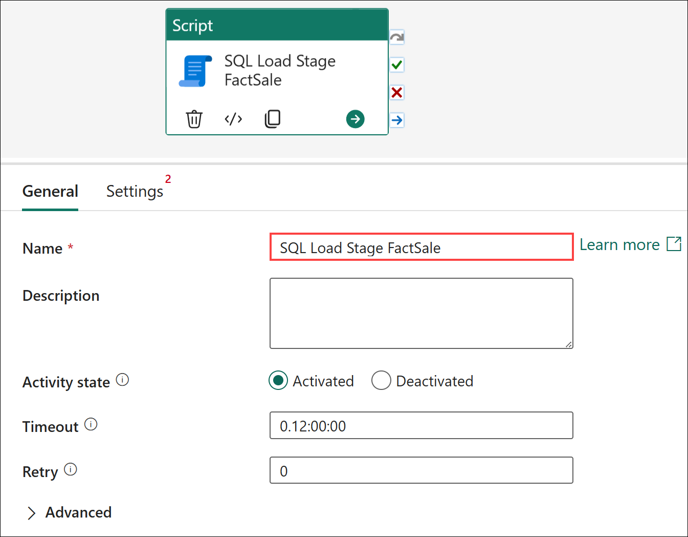

1. Navigate to the **Settings** page.

    - From the **Connection** dropdown select the **WideWorldImportersDW** warehouse.
    - Leave the **Script** option as the default, **Query**.
    - Select the **pencil icon** to the right of the script box to open the editor.
    - Enter the following code, which was also used in *Lab 3 - Loading data* to copy the sales data from the lakehouse to the warehouse stage table. Note this time we are excluding the 2013 data to simulate loading data incrementally.

    ``` sql
    TRUNCATE TABLE stage.FactSale

    INSERT INTO stage.FactSale
    SELECT 
        [CityKey]
        ,[CustomerKey]
        ,[BillToCustomerKey]
        ,[StockItemKey]
        ,[InvoiceDateKey]
        ,[DeliveryDateKey]
        ,[SalespersonKey]
        ,[WWIInvoiceID]
        ,[Description]
        ,[Package]
        ,[Quantity]
        ,[UnitPrice]
        ,[TaxRate]
        ,[TotalExcludingTax]
        ,[TaxAmount]
        ,[Profit]
        ,[TotalIncludingTax]
        ,[TotalDryItems]
        ,[TotalChillerItems]
    FROM OPENROWSET(BULK 'https://fabrictutorialdata.blob.core.windows.net/sampledata/WideWorldImportersDW/parquet/tables/FactSale.parquet') AS FactSale
    WHERE
        YEAR(InvoiceDateKey) != 2013
    ```

    - Select **OK**.

    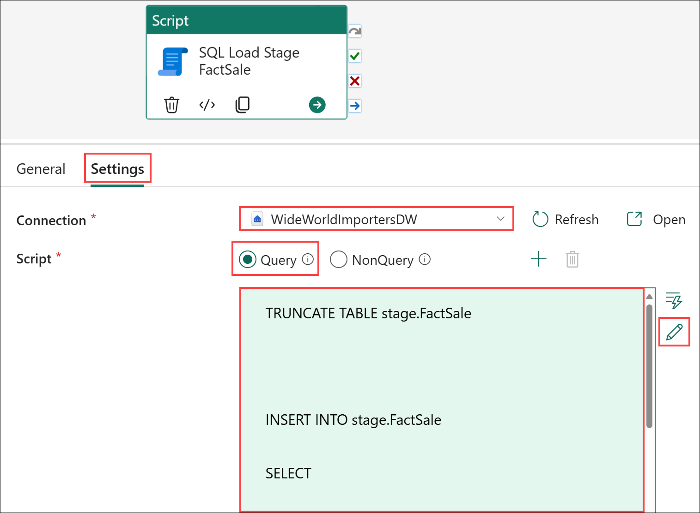

1. From the ribbon, navigate to the **Activities** tab. Select the **Script** activity to add it to the canvas. 

    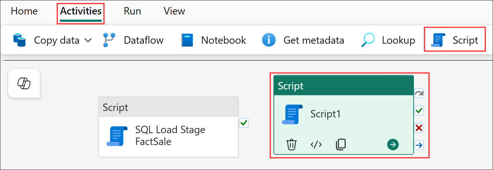

1. With the newly created activity selected, on the **General** page, enter **SQL Load Stage Dimensions** for the **Name** of the activity. 

    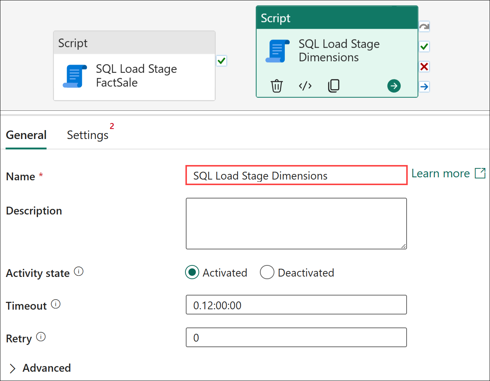

1. Navigate to the **Settings** page.

    - From the **Connection** dropdown select the **WideWorldImportersDW** warehouse.
    - Leave the **Script** option as the default, **Query**.
    - Select the **pencil icon** to the right of the script box to open the editor.
    - Enter the following code, which is a modified version of what was used in Lab 3 to copy the data from Azure storage to the warehouse stage tables for all the dimensions. The fact sale table has been omitted.

    ``` sql
    TRUNCATE TABLE stage.DimCity
    TRUNCATE TABLE stage.DimCustomer
    TRUNCATE TABLE stage.DimEmployee
    TRUNCATE TABLE stage.DimStockItem

    COPY INTO [stage].[DimCity]      FROM 'https://fabrictutorialdata.blob.core.windows.net/sampledata/WideWorldImportersDW/parquet/tables/DimCity.parquet'      WITH (FILE_TYPE = 'PARQUET');
    COPY INTO [stage].[DimCustomer]  FROM 'https://fabrictutorialdata.blob.core.windows.net/sampledata/WideWorldImportersDW/parquet/tables/DimCustomer.parquet'  WITH (FILE_TYPE = 'PARQUET');
    COPY INTO [stage].[DimEmployee]  FROM 'https://fabrictutorialdata.blob.core.windows.net/sampledata/WideWorldImportersDW/parquet/tables/DimEmployee.parquet'  WITH (FILE_TYPE = 'PARQUET');
    COPY INTO [stage].[DimStockItem] FROM 'https://fabrictutorialdata.blob.core.windows.net/sampledata/WideWorldImportersDW/parquet/tables/DimStockItem.parquet' WITH (FILE_TYPE = 'PARQUET');
    ```

    - Select **OK**.

    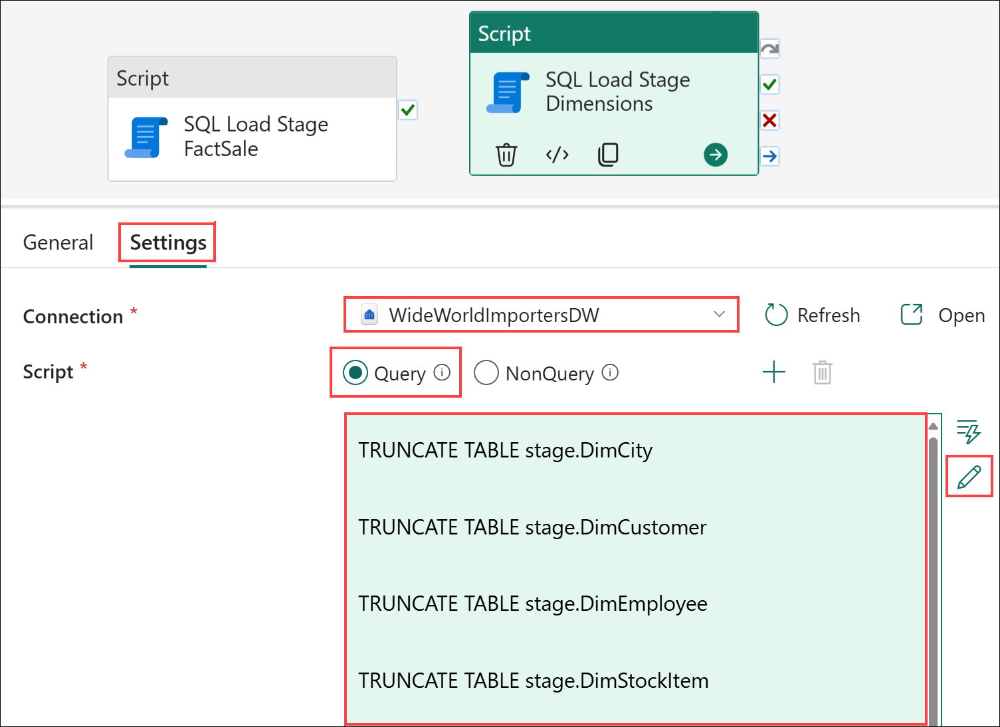

1. From the ribbon, navigate to the **Activities** tab. Select the **Script** activity one final time to add it to the canvas. 

    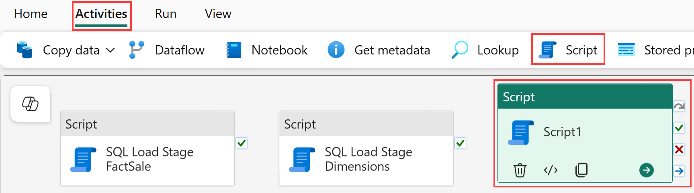

1. With the newly created activity selected, on the **General** page, enter **SQL Transform to Dimensional Model** for the **Name** of the activity. 

    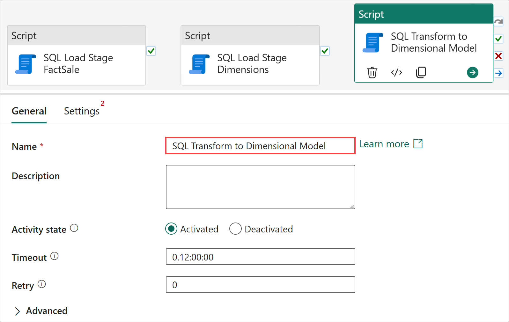

1. Navigate to the **Settings** page.

    - From the **Connection** dropdown select the **WideWorldImportersDW** warehouse.
    - Leave the **Script** option as the default, **Query**.
    - Select the **pencil icon** to the right of the script box to open the editor.
    - Enter the following code, which is a modified version of what was used in Lab 3 to copy the data from Azure storage to the warehouse stage tables for all the dimensions.

    ``` sql
    EXEC dbo.CreateUnknownMembers;
    EXEC dbo.UpdateDimCity;
    EXEC dbo.UpdateDimCustomer;
    EXEC dbo.UpdateDimEmployee;
    EXEC dbo.UpdateDimStockItem;
    EXEC dbo.UpdateFactSale;
    ```

    - Select **OK**.

    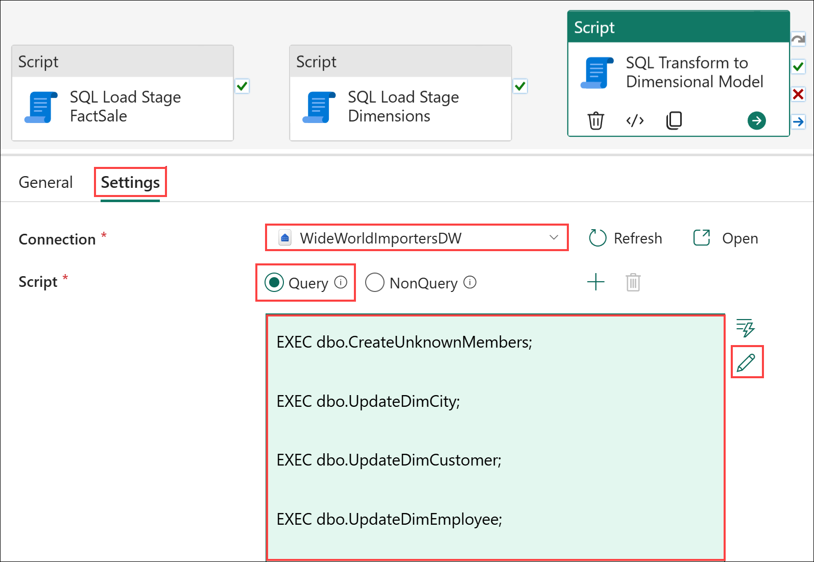

1. With all three scripts configured, it is time to connect them to ensure the proper processing order is followed; stage tables should be loaded before the dimensional model is updated. Locate the **checkbox** on the right side of the **SQL Load Stage FactSale** script activity. Click and hold on the checkbox to select the **On success** (green checkbox) output. While continuing to hold the mouse button, drag and drop the arrow onto the **SQL Transform to Dimensional Model** script activity. A green line should now connect the two activities.

    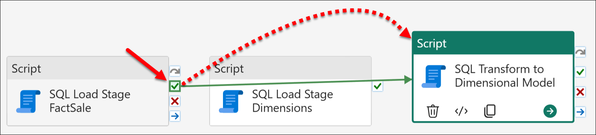

1. Repeat the prior step to connect the **SQL Load Stage Dimensions** script activity to the **SQL Transform to Dimensional Model** script activity. Click and hold the **on success** checkbox on the right side of the SQL Load Stage Dimensions activity, then drag and drop it on the SQL Transform to Dimensional model script activity. 

    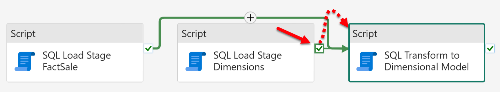

1. Select the **auto align** canvas button on the canvas settings to better align the activities. Verify the pipeline is configured to load stage successfully before moving to update the dimensional model. The diagram should look similar to the image below.

    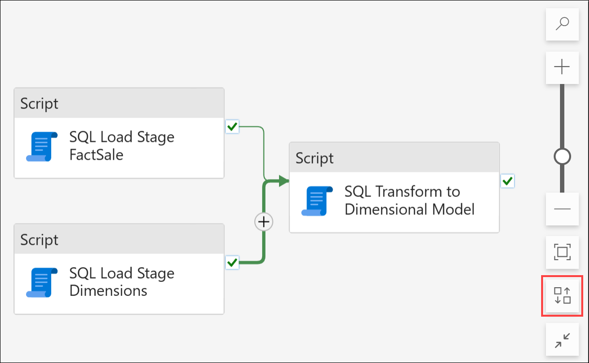

1. Navigate to the **Home** tab on the ribbon and select **Save**.

    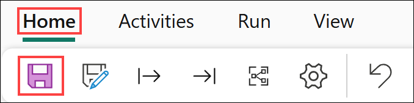

<h3 id = "5.2">5.2 - Scheduling the pipeline</h3>

1. While still in the pipeline editor, navigate to the **Home** tab on the ribbon and select **Schedule**.

    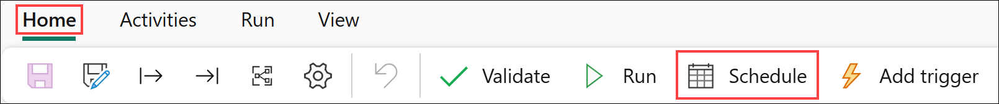

1. Configure the schedule with the following settings.

    *Note: If you are going through this content outside the Fabric Community Conference workshop, you will need to adjust your dates and times accordingly. Start date and time should be a time at or before now, and the end date and time should be some time at least 5 minutes in the future to allow for some additional sales data to be loaded.*

    - Change the **Scheduled run** radio button to **On**.
    - Repeat: **By the minute**
    - Every: **1** minute(s)
    - Start date and time: **Today's date at 9:00 AM** to align with the start of the workshop.
    - End date and time: **Today's date at 4:00 PM** to align with the conclusion of the workshop.
    - Time zone: **(UTC-8:00) Pacific Time (US and Canada)** to align with the time zone of the workshop.
    - Select **Apply**.
    - Note at the top of the screen the next refresh delayed for should say **less than a minute**.
    - Select the **X** in the top right corner of the pane to close the schedule settings. 

    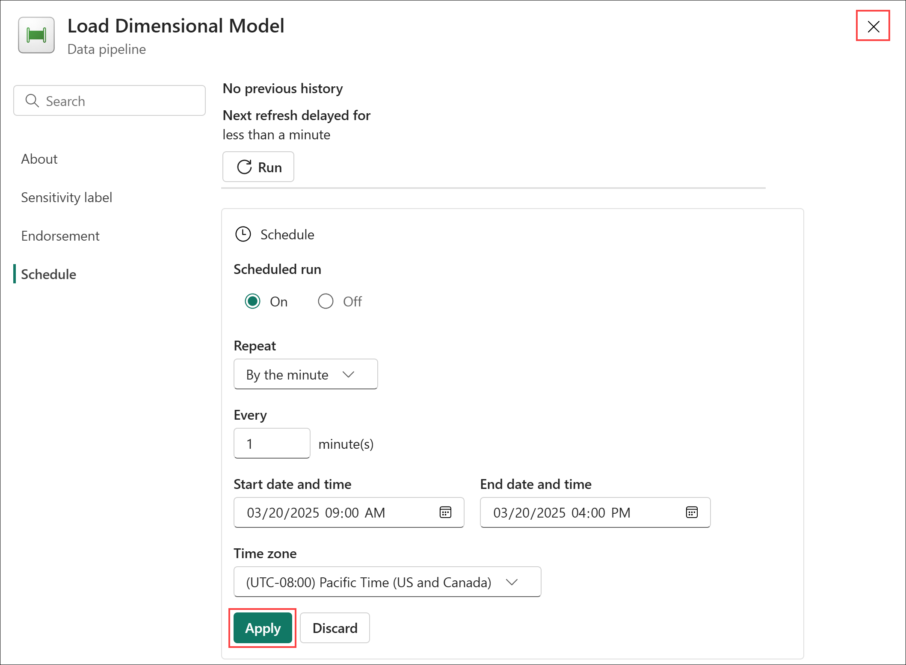

1. Wait for at least 1 minute for the next scheduled run of the pipeline to start then navigate to the **Home** tab on the ribbon and select **View run history**.

    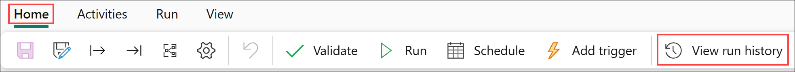

1. Verify the pipeline's schedule is working by reviewing the recent runs list. This list is slightly delayed and may show a status of **Not started** even though the pipeline has completed. Select the **X** in the top right corner to close the recent runs pane. 

    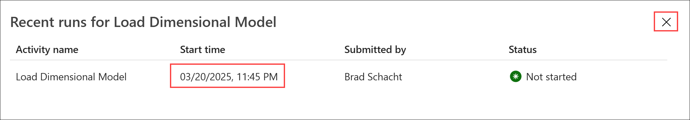

<h3 id = "5.3">5.3 - Validating dimensional model load</h3>

1. Return to the *Modern Data Warehousing on Microsoft Fabric* workspace created in *Lab 0 - Lab environment setup* by selecting the **workspace icon** from the left navigation bar. 

    *Note: The icons on the navigation bar can be pinned and unpinned. Therefore, the icons you see may differ from the screenshot.*

    

1. From the item list, select **The Workshop** notebook and navigate to **Lab 5 - Orchestrating warehouse operations**, and locate the **5.3 - Validating dimensional model load** section.

    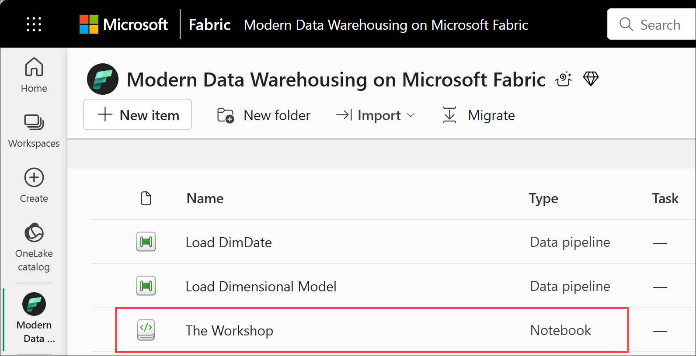

1. Check the record count on all the tables by running the cell for **Step 5.3.3** in *The Workshop* notebook. Upon completion, the cell will display a set of query results that show the record counts on all the stage and dimensional model tables. 

    Take special note of the fact table's record count. You will notice the stage table has a smaller number of records than the dimensional model table. This is because the stage table is loading all the data except 2013, but you loaded the 2013 data into the dimensional model in Lab 4. This can be seen very clearly by looking at the record counts for the FactSale table broken down by year. Notice the stage table has no 2013 data, but the dimensional model table does. 

    ``` sql
    SELECT 'dbo'   AS SchemaName, 'DimCity'         AS TableName, FORMAT(COUNT_BIG(*), 'N0') AS RecordCount FROM dbo.DimCity                                      UNION ALL
    SELECT 'dbo'   AS SchemaName, 'DimCustomer'     AS TableName, FORMAT(COUNT_BIG(*), 'N0') AS RecordCount FROM dbo.DimCustomer                                  UNION ALL
    SELECT 'dbo'   AS SchemaName, 'DimDate'         AS TableName, FORMAT(COUNT_BIG(*), 'N0') AS RecordCount FROM dbo.DimDate                                      UNION ALL
    SELECT 'dbo'   AS SchemaName, 'DimEmployee'     AS TableName, FORMAT(COUNT_BIG(*), 'N0') AS RecordCount FROM dbo.DimEmployee                                  UNION ALL
    SELECT 'dbo'   AS SchemaName, 'DimStockItem'    AS TableName, FORMAT(COUNT_BIG(*), 'N0') AS RecordCount FROM dbo.DimStockItem                                 UNION ALL
    SELECT 'dbo'   AS SchemaName, 'FactSale'        AS TableName, FORMAT(COUNT_BIG(*), 'N0') AS RecordCount FROM dbo.FactSale                                     UNION ALL
    SELECT 'dbo'   AS SchemaName, 'FactSale - 2013' AS TableName, FORMAT(COUNT_BIG(*), 'N0') AS RecordCount FROM dbo.FactSale WHERE YEAR(InvoiceDateKey) = 2013   UNION ALL
    SELECT 'dbo'   AS SchemaName, 'FactSale - 2014' AS TableName, FORMAT(COUNT_BIG(*), 'N0') AS RecordCount FROM dbo.FactSale WHERE YEAR(InvoiceDateKey) = 2014   UNION ALL
    SELECT 'dbo'   AS SchemaName, 'FactSale - 2015' AS TableName, FORMAT(COUNT_BIG(*), 'N0') AS RecordCount FROM dbo.FactSale WHERE YEAR(InvoiceDateKey) = 2015   UNION ALL
    SELECT 'dbo'   AS SchemaName, 'FactSale - 2016' AS TableName, FORMAT(COUNT_BIG(*), 'N0') AS RecordCount FROM dbo.FactSale WHERE YEAR(InvoiceDateKey) = 2016   UNION ALL
    SELECT 'stage' AS SchemaName, 'DimCity'         AS TableName, FORMAT(COUNT_BIG(*), 'N0') AS RecordCount FROM stage.DimCity                                    UNION ALL
    SELECT 'stage' AS SchemaName, 'DimCustomer'     AS TableName, FORMAT(COUNT_BIG(*), 'N0') AS RecordCount FROM stage.DimCustomer                                UNION ALL
    SELECT 'stage' AS SchemaName, 'DimEmployee'     AS TableName, FORMAT(COUNT_BIG(*), 'N0') AS RecordCount FROM stage.DimEmployee                                UNION ALL
    SELECT 'stage' AS SchemaName, 'DimStockItem'    AS TableName, FORMAT(COUNT_BIG(*), 'N0') AS RecordCount FROM stage.DimStockItem                               UNION ALL
    SELECT 'stage' AS SchemaName, 'FactSale'        AS TableName, FORMAT(COUNT_BIG(*), 'N0') AS RecordCount FROM stage.FactSale                                   UNION ALL
    SELECT 'stage' AS SchemaName, 'FactSale - 2013' AS TableName, FORMAT(COUNT_BIG(*), 'N0') AS RecordCount FROM stage.FactSale WHERE YEAR(InvoiceDateKey) = 2013 UNION ALL
    SELECT 'stage' AS SchemaName, 'FactSale - 2014' AS TableName, FORMAT(COUNT_BIG(*), 'N0') AS RecordCount FROM stage.FactSale WHERE YEAR(InvoiceDateKey) = 2014 UNION ALL
    SELECT 'stage' AS SchemaName, 'FactSale - 2015' AS TableName, FORMAT(COUNT_BIG(*), 'N0') AS RecordCount FROM stage.FactSale WHERE YEAR(InvoiceDateKey) = 2015 UNION ALL
    SELECT 'stage' AS SchemaName, 'FactSale - 2016' AS TableName, FORMAT(COUNT_BIG(*), 'N0') AS RecordCount FROM stage.FactSale WHERE YEAR(InvoiceDateKey) = 2016
    ORDER BY
        SchemaName,
        TableName
    ```

    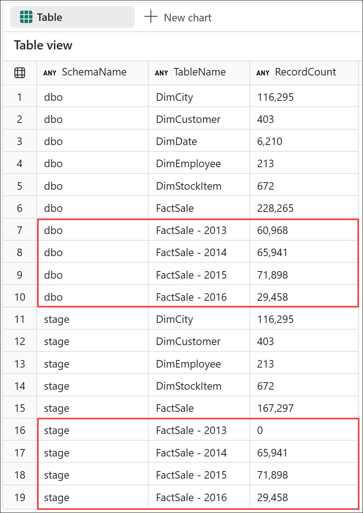

1. If you were to rerun the query from the prior step every minute, you will notice the 2013 data remains in the dimensional model table but it never gets reloaded into the stage table. Similarly, the 2014-2016 data will be loaded into stage, but the incremental logic prevents the data from duplicating in the fact table.

## Next steps
In this lab you built a pipeline to orchestrate the repeated incremental loading of the data warehouse. You used a pipeline to ensure the operations happened in the proper order:

- Stage is truncated
- Stage is reloaded
- Unknown members are added to the dimension tables
- Dimension tables are incrementally loaded
- Fact tables are incrementally loaded

While there are many complexities that will come into play in the real world, like late arriving data, varying load schedules, incrementally loading the stage data, etc. the work done in the modules to this point will serve as a general guide for loading a data warehouse.

- Continue to [Lab 6 - Advanced query techniques](<06 - Advanced query techniques.md>)
- Return to the [workshop homepage](<../README.md>)

## Additional Resources
- [Dimensional modeling in Microsoft Fabric Warehouse: Load tables](https://learn.microsoft.com/en-us/fabric/data-warehouse/dimensional-modeling-load-tables#process-fact-tables)
- [Data pipeline Runs](https://learn.microsoft.com/en-us/fabric/data-factory/pipeline-runs)
- [How to monitor data pipeline runs in Microsoft Fabric](https://learn.microsoft.com/en-us/fabric/data-factory/monitor-pipeline-runs)
- [How to use Script activity](https://learn.microsoft.com/en-us/fabric/data-factory/script-activity)
