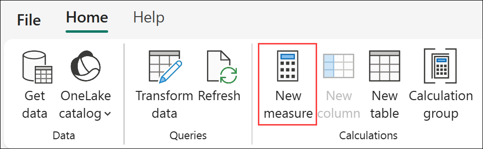
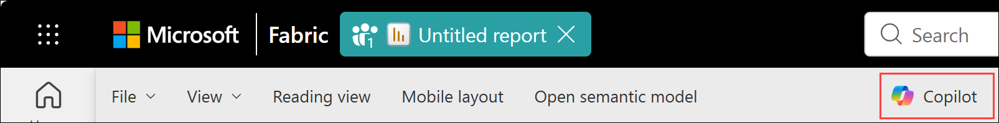

# Lab 5 - Visualizing data with Power BI

Before you begin:

- If you have not completed Lab 4 - Conversational AI with Fabric Data Agents, go complete all the steps then return here to continue.

This lab will cover:

- Creating a semantic model
- Building a report with Copilot

<hr>

### 5.1 - Creating a semantic model

1. If necessary, return to the *@lab.CloudResourceTemplate(FabricPerUserPOCv3).Parameters[capacityName]* workspace created in *Lab 1 - Getting started* by selecting the **workspace icon** from the left navigation bar then selecting your workspace name from the flyout. 

    *Note: The icons on the navigation bar can be pinned and unpinned. Therefore, the icons you see may differ from the screenshot.*

    

1. With the Fabric workspace open, select **New item** located just below the workspace name.

    

1. From the **All items** view, locate the **Store data** section and select the **Semantic model** tile. 

    

1. On the **Add data to start building a report** page, select **OneLake catalog**. 

    

1. On the **Discover data from across your org and use it to create reports** page, select the **Sales** data warehouse then select **Connect**.

    

1. On the **Choose tables from OneLake** page perform the following actions:

    - In the box with the text **Enter a semantic model name**, enter **++Sales and Marketing++**.
    - Check the box next to **dbo** to automatically select all the tables in the schema:
        - DimCustomer
        - DimDate
        - DimProduct
        - FactSales
    - Select **Confirm**.

    

1. From the **Home** tab of the ribbon, select **Manage relationships**. 

    

1. On the **Manage relationships** page, select **New relationship**.

    

1. On the **New relationship** page perform the following actions:

    - On the **From table** dropdown, select **FactSales**.
    - On the **To table** dropdown, select **DimCustomer**.
    - Ensure the **CustomerKey** field on the **FactSales** preview grid is selected (the column will be a darker gray than the rest).
    - Ensure the **CustomerKey** field on the **DimCustomer** preview grid is selected (the column will be a darker gray than the rest).
    - Ensure the **Cardinality** is set to **Many to one (*:1)**.
    - Select **Save**.

    

1. On the **Manage relationships** page select **New relationship** and perform the following actions:

    - On the **From table** dropdown, select **FactSales**.
    - On the **To table** dropdown, select **DimProduct**.
    - Ensure the **ProductKey** field on the **FactSales** preview grid is selected (the column will be a darker gray than the rest).
    - Ensure the **ProductKey** field on the **DimProduct** preview grid is selected (the column will be a darker gray than the rest).
    - Ensure the **Cardinality** is set to **Many to one (*:1)**.
    - Select **Save**.

    

1. On the **Manage relationships** page select **New relationship** and perform the following actions:

    - On the **From table** dropdown, select **FactSales**.
    - On the **To table** dropdown, select **DimDate**.
    - On the preview grid for the **FactSales** table, select the **OrderDateKey** column (the column will turn to a darker gray than the rest).
    - On the preview grid for the **DimDate** table, select the **DateKey** column (the column will turn to a darker gray than the rest).
    - Ensure the **Cardinality** is set to **Many to one (*:1)**.
    - Select **Save**.

    

1. On the **Manage relationships** page select **Close**.

    

1. From the **Data** pane on the far right side of the screen select the **FactSales** table from the list.

    

1. From the **Home** tab of the ribbon, select **New measure** from the Calculations group.

    

1. In the formula bar enter the following DAX calculation then select **Commit** (the green check mark) to the left of the formula (or press Enter on the keyboard):

    ```
    Total Sales = CALCULATE(SUM('FactSales'[SalesAmount]))
    ```

    

1. From the **Home** tab of the ribbon, select **New measure** from the Calculations group.

    

1. In the formula bar enter the following DAX calculation then select **Commit** (the green check mark) to the left of the formula (or press Enter on the keyboard):

    ```
    Total Sales Last Year = VAR LY = LASTNONBLANK(DimDate[CalendarYear], 1)-1
    Return  
    CALCULATE([Total Sales],
    DimDate[CalendarYear]=LY
    )
    ```

    

### 5.2 - Building a report with Copilot

1. From the ribbon select **File**. On the menu select **Create new report**. A new tab will open with a blank report canvas. 

    

1. From the ribbon select **Copilot**. A Copilot pane will open on the far right side of the page.

    

1. In the text box at the bottom of the Copilot pane, enter the text **++Create a new report that visualizes customer demographics and country region data. Focus on Total Sales, Total Sales Last Year, and OrderQuantity.++** then select **Send**.

    

    A report page that resembles the one below will be generated.

    

1. From the ribbon select **File** -> **Save**.

    

1. On the **Save your report** page enter the report name **++Customer Demographics and Country Region Analysis++** and select **Save**.

    

## Next steps
In this lab you created a Direct Lake semantic model directly inside the Fabric UX. You added relationships to tables and created two calculations using DAX. Then you created a report on top of the semantic model using Copilot to develop quickly. 

- Select **Next** to continue to the **Conclusion and resources** page
- Select **Previous** to return to **Lab 4 - Conversational AI with Fabric Data Agents**

## Additional Resources
- [Direct Lake Overview](https://learn.microsoft.com/en-us/fabric/fundamentals/direct-lake-overview)
- [Develop Direct Lake semantic models](https://learn.microsoft.com/en-us/fabric/fundamentals/direct-lake-develop)
- [Direct Lake in web modeling](https://learn.microsoft.com/en-us/fabric/fundamentals/direct-lake-web-modeling)
- [Direct Lake in Power BI Desktop](https://learn.microsoft.com/en-us/fabric/fundamentals/direct-lake-power-bi-desktop)
- [Create and edit reports in the Power BI service with Copilot](https://learn.microsoft.com/en-us/power-bi/create-reports/copilot-create-report-service)
