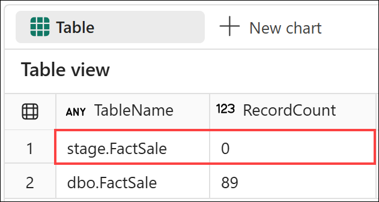
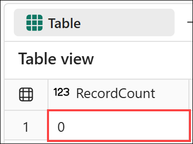
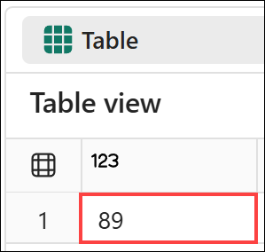
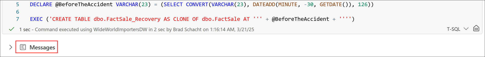
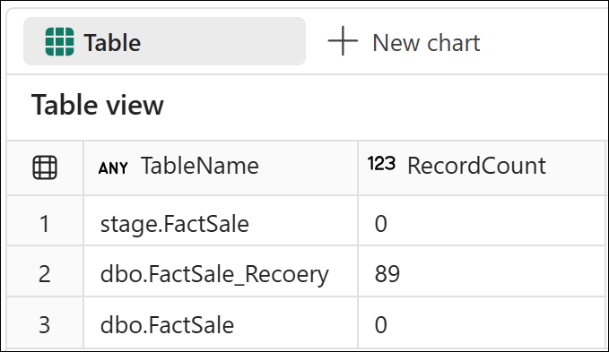
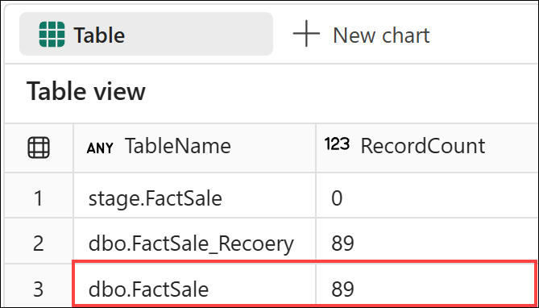

# End-to-End Data Engineering:<br>Modern Data Warehousing on Microsoft Fabric

## Lab 6 - Advanced query techniques

Before you begin:

- Make sure you have read the overview on the [workshop homepage](<../README.md>).
- If you have not completed [Lab 5 - Orchestrating warehouse operations](<05 - Orchestrating warehouse operations.md>), go complete all the steps then return here to continue.

This lab will cover:

- <a href="#6.1">Time travel</a>
- <a href="#6.2">Clone a table</a>

<hr>

<h3 id = "6.1">6.1 - Time travel</h3>

*Note: If you just completed Lab 5 and still have The Workshop notebook open, remain in The Workshop notebook, navigate to **Lab 6 - Advanced query techniques**, locate the **6.1 - Time travel** section, and move straight to step 3 below.*

1. Return to the *Modern Data Warehousing on Microsoft Fabric* workspace created in *Lab 0 - Lab environment setup* by selecting the **workspace icon** from the left navigation bar. 

    *Note: The icons on the navigation bar can be pinned and unpinned. Therefore, the icons you see may differ from the screenshot.*

    

1. From the item list, select **The Workshop** notebook and navigate to **Lab 6 - Advanced query techniques**, and locate the **6.1 - Time travel** section.

    

1. Check the number of records in *dbo.FactSale* and *stage.FactSale* for January 1, 2013 by running the cell for **Step 6.1.3** in *The Workshop* notebook. Upon completion, a set of query results will be displayed. 

    ``` sql
    SELECT 'dbo.FactSale'   AS TableName, COUNT(*) AS RecordCount FROM dbo.FactSale   WHERE InvoiceDateKey = '2013-01-01' UNION ALL
    SELECT 'stage.FactSale' AS TableName, COUNT(*) AS RecordCount FROM stage.FactSale WHERE InvoiceDateKey = '2013-01-01'
    ORDER BY TableName DESC
    ```

    Note from the results that the data for January 1, 2013 no longer exists in the stage table. This means if the data were deleted or changed there would be no way to easily recover it from the source system. **Let's delete the data!**

    

1.  Delete the 89 records from January 1, 2013 and verify they were removed by running the cell for **Step 6.1.4** in *The Workshop* notebook. Upon completion, a set of query results will be displayed. 

    ``` sql
    DELETE FROM dbo.FactSale WHERE InvoiceDateKey = '2013-01-01'
    SELECT COUNT(*) AS RecordCount FROM dbo.FactSale WHERE InvoiceDateKey = '2013-01-01'
    ```

    

1. We can validate that the data looked a certain way in the past using time travel. Use a dynamic SQL statement to do a count on the table as it looked 30 minutes ago by running the cell for **Step 6.1.5** in *The Workshop* notebook. Upon completion, a set of query results will be displayed.

    ``` sql
    DECLARE @BeforeTheAccident VARCHAR(23) = (SELECT CONVERT(VARCHAR(23), DATEADD(MINUTE, -30, GETDATE()), 126))
    EXEC ('SELECT COUNT(*) FROM dbo.FactSale WHERE InvoiceDateKey = ''2013-01-01'' OPTION (FOR TIMESTAMP AS OF ''' + @BeforeTheAccident + ''')');
    ```
    
    Using this query, we can verify there are in fact 89 records that are missing.

    

Now that we know the data exists, let's look at how table clones can help us recover. 

<h3 id = "6.2">6.2 - Clone a table</h3>

Before beginning, open *The Workshop* notebook, navigate to **Lab 6 - Advanced query techniques**, and locate the **6.2 - Clone a table** section.

1. Use a dynamic SQL statement to create a clone of the dbo.FactSale table as of about 30 minutes ago when the data from January 1, 2013 was still present in the table by running the cell for **Step 6.2.1** in *The Workshop* notebook. Upon completion, the cell will have a messages output but no query results.

    ``` sql
    DROP TABLE IF EXISTS dbo.FactSale_Recovery

    DECLARE @BeforeTheAccident VARCHAR(23) = (SELECT CONVERT(VARCHAR(23), DATEADD(MINUTE, -30, GETDATE()), 126))

    EXEC ('CREATE TABLE dbo.FactSale_Recovery AS CLONE OF dbo.FactSale AT ''' + @BeforeTheAccident + '''')
    ```

    

1. Count the number of records in the cloned table and compare it to the record count in the stage and dimensional model tables by running the cell for **Step 6.2.2** in *The Workshop* notebook.

    ``` sql
    SELECT 'dbo.FactSale'         AS TableName, COUNT(*) AS RecordCount FROM dbo.FactSale          WHERE InvoiceDateKey = '2013-01-01' UNION ALL
    SELECT 'dbo.FactSale_Recovery' AS TableName, COUNT(*) AS RecordCount FROM dbo.FactSale_Recovery WHERE InvoiceDateKey = '2013-01-01' UNION ALL
    SELECT 'stage.FactSale'       AS TableName, COUNT(*) AS RecordCount FROM stage.FactSale        WHERE InvoiceDateKey = '2013-01-01'
    ORDER BY TableName DESC
    ```

    Notice there are no records in stage.FactSale or dbo.FactSale but there are 89 records in dbo.FactSale_Recovery. 

    

1. Next, add the records back to the dbo.FactSale table by running the cell for **Step 6.2.3** in *The Workshop* notebook. Verify the operation had the intended effect by comparing records counts one final time by examining the results.

    ``` sql
    INSERT INTO dbo.FactSale
    SELECT * FROM dbo.FactSale_Recovery WHERE InvoiceDateKey = '2013-01-01'

    SELECT 'dbo.FactSale'         AS TableName, COUNT(*) AS RecordCount FROM dbo.FactSale          WHERE InvoiceDateKey = '2013-01-01' UNION ALL
    SELECT 'dbo.FactSale_Recovery' AS TableName, COUNT(*) AS RecordCount FROM dbo.FactSale_Recovery WHERE InvoiceDateKey = '2013-01-01' UNION ALL
    SELECT 'stage.FactSale'       AS TableName, COUNT(*) AS RecordCount FROM stage.FactSale        WHERE InvoiceDateKey = '2013-01-01'
    ORDER BY TableName DESC
    ```

    

## Next steps
In this lab you saw how time travel can allow you to see what tables looked like at a certain point in the past. Using time travel, you discovered some data was accidentally deleted from a table and that it was not available in the stage table. To recover the data you then used a clone as of a point in time to create a table clone at a time when the missing records existed. With that table cloned you were able to add the missing records back into the table thereby recovering the deleted data!

- Continue to [Lab 7 - Data warehouse management](<07 - Data warehouse management.md>)
- Return to the [workshop homepage](<../README.md>)

## Additional Resources
- [Clone table in Microsoft Fabric](https://learn.microsoft.com/en-us/fabric/data-warehouse/clone-table)
- [Clone tables in the Fabric portal](https://learn.microsoft.com/en-us/fabric/data-warehouse/tutorial-clone-table-portal)
- [Restore in-place of a warehouse in Microsoft Fabric](https://learn.microsoft.com/en-us/fabric/data-warehouse/restore-in-place)
- [Restore in-place in the Fabric portal](https://learn.microsoft.com/en-us/fabric/data-warehouse/restore-in-place-portal)
- [Query using time travel at the statement level](https://learn.microsoft.com/en-us/fabric/data-warehouse/how-to-query-using-time-travel)
