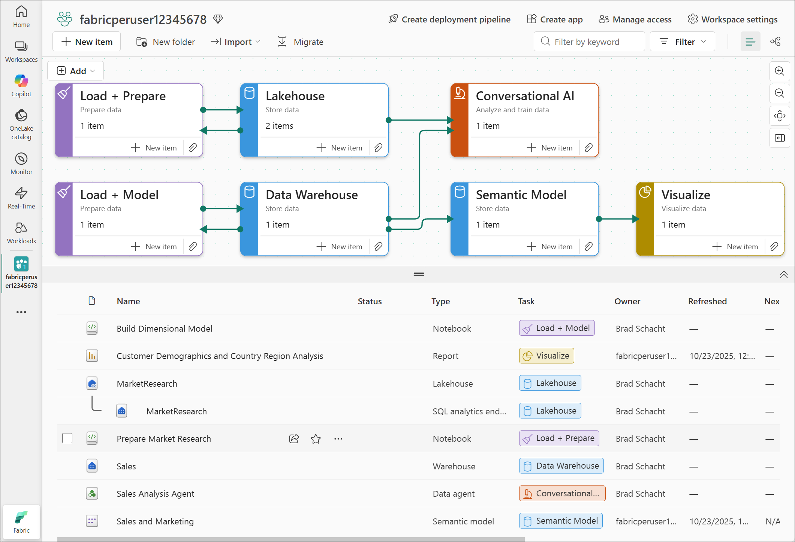

# Conclusion and resources

***Congradulations!***

You did it! You completed all the labs for this workshop!

Today you created an end-to-end analytics solution in Microsoft Fabric which included:

- Lakehouse 
- Spark notebook 
- Data warehouse 
- T-SQL notebook 
- Data agent 
- Semantic model 
- Power BI report 

## Feedback
Your feedback is very useful for us and helps us improve our labs for future events. Please visit [aka.ms/ignite25-feedback](https://aka.ms/ignite25-feedback) to fill out the evaluation for this lab and other Ignite 2025 sessions. 

## Next steps
This may be where our workshop ends today, but it is not the end of the analytics journey. Beyond what we covered is a world full of data integration, OneLake capabilities, security, data science with Spark, operational databases, and real-time intelligence use cases waiting to bring more value to your business. We would encourage you to check out the rest of what Microsoft Fabric has to offer!

## Consolidated Resources
This lab is available for reference after the conference at: 

**Lab 1 - Getting started**
- [Getting started with Microsoft Fabric](https://www.microsoft.com/en-us/microsoft-fabric/getting-started)
- [Enable Microsoft Fabric for your organization](https://learn.microsoft.com/en-us/fabric/admin/fabric-switch)
- [Fabric region availability](https://learn.microsoft.com/en-us/fabric/admin/region-availability)
- [Microsoft Fabric concepts and licenses](https://learn.microsoft.com/en-us/fabric/enterprise/licenses)
- [Microsoft Fabric trial capacity](https://learn.microsoft.com/en-us/fabric/fundamentals/fabric-trial)

**Lab 2 - Lakehouses and Data Engineering with Spark**
- [What is a lakehouse in Microsoft Fabric?](https://learn.microsoft.com/en-us/fabric/data-engineering/lakehouse-overview)
- [Lakehouse and Delta Lake tables](https://learn.microsoft.com/en-us/fabric/data-engineering/lakehouse-and-delta-tables)
- [Develop, execute, and manage Microsoft Fabric notebooks](https://learn.microsoft.com/en-us/fabric/data-engineering/author-execute-notebook)
- [How to use Microsoft Fabric notebooks](https://learn.microsoft.com/en-us/fabric/data-engineering/how-to-use-notebook)
- [Use a notebook to load data into your lakehouse](https://learn.microsoft.com/en-us/fabric/data-engineering/lakehouse-notebook-load-data)

**Lab 3 - Dimensional Modeling with Data Warehouse**
- [Tables in data warehousing in Microsoft Fabric](https://learn.microsoft.com/en-us/fabric/data-warehouse/tables)
- [Data types in Microsoft Fabric](https://learn.microsoft.com/en-us/fabric/data-warehouse/data-types)
- [Primary keys, foreign keys, and unique keys in Warehouse in Microsoft Fabric](https://learn.microsoft.com/en-us/fabric/data-warehouse/table-constraints)
- [Dimensional modeling in Microsoft Fabric Warehouse: Dimension tables](https://learn.microsoft.com/en-us/fabric/data-warehouse/dimensional-modeling-dimension-tables)
- [Dimensional modeling in Microsoft Fabric Warehouse: Fact tables](https://learn.microsoft.com/en-us/fabric/data-warehouse/dimensional-modeling-fact-tables)

**Lab 4 - Conversational AI with Fabric Data Agents**
- [Configure Fabric data agent tenant settings](https://learn.microsoft.com/en-us/fabric/data-science/data-agent-tenant-settings)
- [Create a Fabric data agent](https://learn.microsoft.com/en-us/fabric/data-science/how-to-create-data-agent)
- [Fabric data agent example](https://learn.microsoft.com/en-us/fabric/data-science/data-agent-end-to-end-tutorial)
- [Configure your data agent](https://learn.microsoft.com/en-us/fabric/data-science/data-agent-configurations)
- [Consume a Fabric Data Agent in Microsoft Copilot Studio](https://learn.microsoft.com/en-us/fabric/data-science/data-agent-microsoft-copilot-studio)

**Lab 5 - Visualizing data with Power BI**
- [Direct Lake Overview](https://learn.microsoft.com/en-us/fabric/fundamentals/direct-lake-overview)
- [Develop Direct Lake semantic models](https://learn.microsoft.com/en-us/fabric/fundamentals/direct-lake-develop)
- [Direct Lake in web modeling](https://learn.microsoft.com/en-us/fabric/fundamentals/direct-lake-web-modeling)
- [Direct Lake in Power BI Desktop](https://learn.microsoft.com/en-us/fabric/fundamentals/direct-lake-power-bi-desktop)
- [Create and edit reports in the Power BI service with Copilot](https://learn.microsoft.com/en-us/power-bi/create-reports/copilot-create-report-service)
