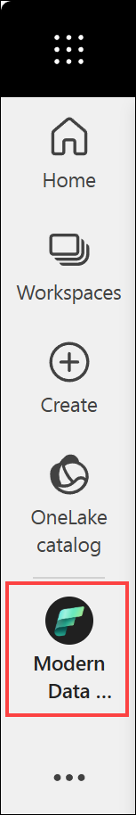
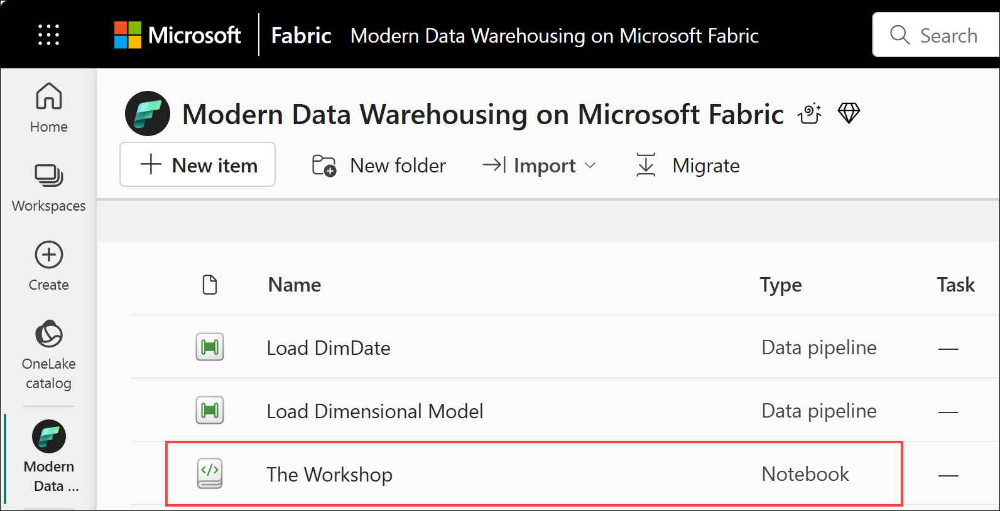
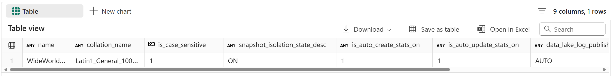
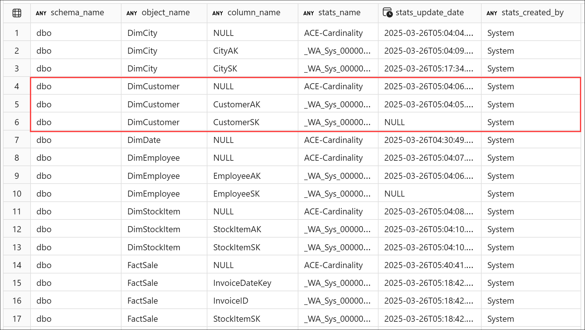
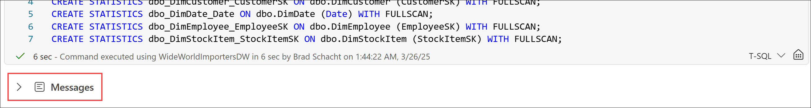
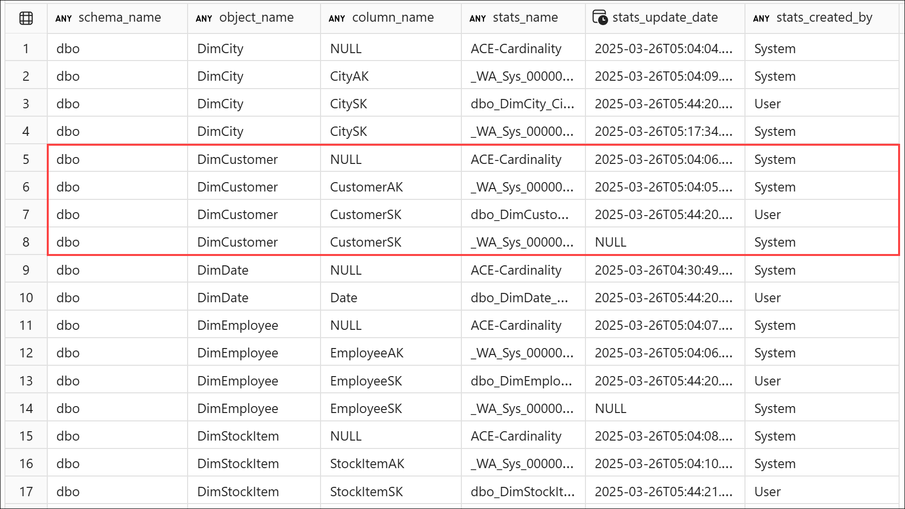
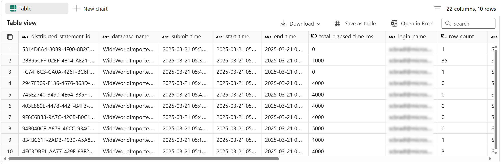
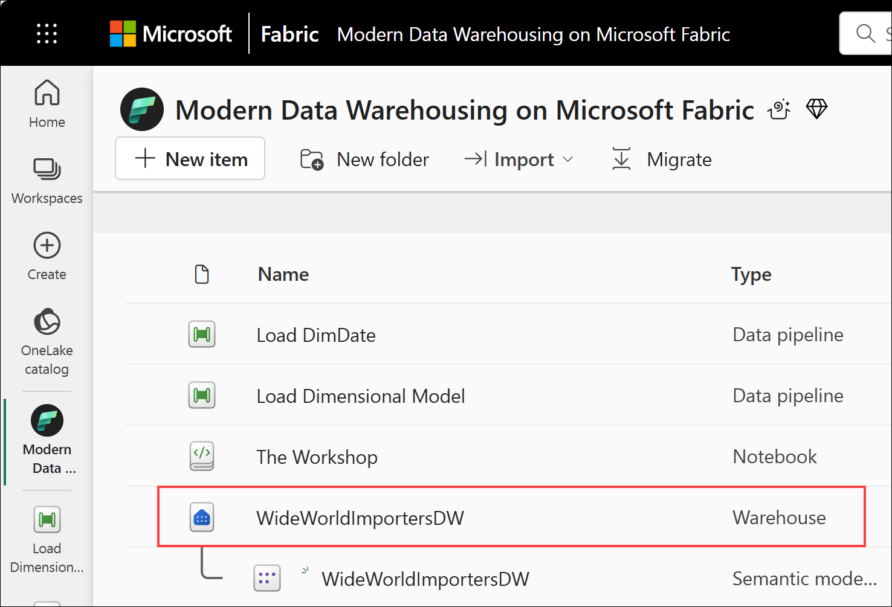
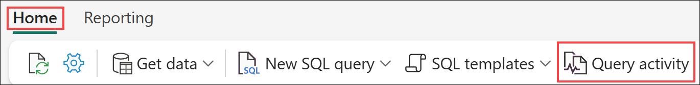
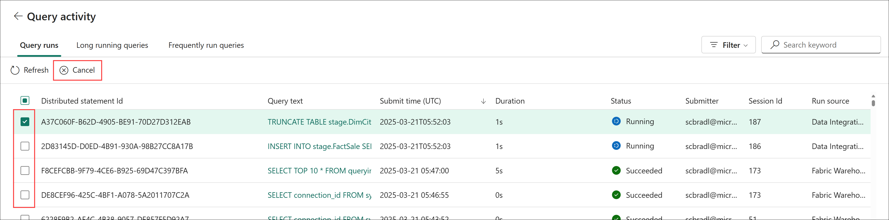

# End-to-End Data Engineering:<br>Modern Data Warehousing on Microsoft Fabric

## Lab 7 - Data warehouse management

Before you begin:

- Make sure you have read the overview on the [workshop homepage](<../README.md>).
- If you have not completed [Lab 6 - Advanced query techniques](<06 - Advanced query techniques.md>), go complete all the steps then return here to continue.

This lab will cover:

- <a href="#7.1">Checking important warehouse settings</a>
- <a href="#7.2">Statistics management</a>
- <a href="#7.3">Query monitoring</a>

<hr>

<h3 id = "7.1">7.1 - Checking important warehouse settings</h3>

*Note: If you just completed Lab 6 and still have The Workshop notebook open, remain in The Workshop notebook, navigate to **Lab 7 - Data warehouse management**, locate the **7.1 - Checking important warehouse settings** section, and move straight to step 3 below.*

1. Return to the *Modern Data Warehousing on Microsoft Fabric* workspace created in *Lab 0 - Lab environment setup* by selecting the **workspace icon** from the left navigation bar. 

    *Note: The icons on the navigation bar can be pinned and unpinned. Therefore, the icons you see may differ from the screenshot.*

    

1. From the item list, select **The Workshop** notebook and navigate to **Lab 7 - Data warehouse management**, and locate the **7.1 - Checking important warehouse settings** section.

    

1. To see the current setting for the items listed below, run the cell for **Step 7.1.3** in *The Workshop* notebook. Upon completion, the cell will a set of query results will be displayed. :

    - Collation
    - Case sensitivity
    - Snapshot isolation
    - Statistics auto create
    - Statistics auto update
    - Delta log publishing
    - V-Order

    ``` sql
    SELECT
        name,
        collation_name,
        CASE collation_name
            WHEN 'Latin1_General_100_BIN2_UTF8'           THEN 1
            WHEN 'Latin1_General_100_CI_AS_KS_WS_SC_UTF8' THEN 0
            ELSE NULL
            END AS is_case_sensitive,
        snapshot_isolation_state_desc,
        is_auto_create_stats_on,
        is_auto_update_stats_on,
        data_lake_log_publishing_desc,
        CASE data_lake_log_publishing_desc
            WHEN 'AUTO' THEN 1
            WHEN 'PAUSED' THEN 0
            ELSE NULL
            END AS is_delta_lake_log_publishing_on,
        is_vorder_enabled
    FROM sys.databases
    WHERE name = DB_NAME()
    ```

    

<h3 id = "7.2">7.2 - Statistics management</h3>

Before beginning, open *The Workshop* notebook, navigate to **Lab 7 - Data warehouse management**, and locate the **7.2 - Statistics management** section.

1. You can see the types of statistics which have already been generated by the system by running the cell for **Step 7.2.1** in *The Workshop* notebook and exploring the results.

    ``` sql
    SELECT
        schema_name(o.schema_id) AS schema_name,
        object_name(s.object_id) AS [object_name],
        c.name AS [column_name],
        s.name AS [stats_name],
        STATS_DATE(s.object_id, s.stats_id) AS [stats_update_date], 
        CASE
            WHEN s.auto_created = 1 THEN 'System'
            WHEN s.user_created = 1 THEN 'User'
            ELSE NULL END AS stats_created_by
    FROM sys.stats AS s 
    INNER JOIN sys.objects AS o 
        ON o.object_id = s.object_id 
    LEFT JOIN sys.stats_columns AS sc 
        ON s.object_id = sc.object_id 
        AND s.stats_id = sc.stats_id 
    LEFT JOIN sys.columns AS c 
        ON sc.object_id = c.object_id 
        AND c.column_id = sc.column_id
    WHERE
        o.type = 'U'
        AND (s.auto_created = 1 or s.user_created = 1)
    ORDER BY
        schema_name,
        object_name,
        column_name
    ```
    
    

1. Manually create statistics on all the primary key columns by running the cell for **Step 7.2.2** in *The Workshop* notebook. Upon completion, the cell will have a messages output but no query results.

    ``` sql
    CREATE STATISTICS dbo_DimCity_CitySK ON dbo.DimCity (CitySK) WITH FULLSCAN;
    CREATE STATISTICS dbo_DimCustomer_CustomerSK ON dbo.DimCustomer (CustomerSK) WITH FULLSCAN;
    CREATE STATISTICS dbo_DimDate_Date ON dbo.DimDate (Date) WITH FULLSCAN;
    CREATE STATISTICS dbo_DimEmployee_EmployeeSK ON dbo.DimEmployee (EmployeeSK) WITH FULLSCAN;
    CREATE STATISTICS dbo_DimStockItem_StockItemSK ON dbo.DimStockItem (StockItemSK) WITH FULLSCAN;
    ```

    

1. See all the stats on the tables again by running the cell for **Step 7.2.3** in *The Workshop* notebook and compare the results to the results from two steps ago, *Step 1*, to see the inclusion of user created stats. 

    ``` sql
    SELECT
        schema_name(o.schema_id) AS schema_name,
        object_name(s.object_id) AS [object_name],
        c.name AS [column_name],
        s.name AS [stats_name],
        STATS_DATE(s.object_id, s.stats_id) AS [stats_update_date], 
        CASE
            WHEN s.auto_created = 1 THEN 'System'
            WHEN s.user_created = 1 THEN 'User'
            ELSE NULL END AS stats_created_by
    FROM sys.stats AS s 
    INNER JOIN sys.objects AS o 
        ON o.object_id = s.object_id 
    LEFT JOIN sys.stats_columns AS sc 
        ON s.object_id = sc.object_id 
        AND s.stats_id = sc.stats_id 
    LEFT JOIN sys.columns AS c 
        ON sc.object_id = c.object_id 
        AND c.column_id = sc.column_id
    WHERE
        o.type = 'U'
        AND (s.auto_created = 1 or s.user_created = 1)
    ORDER BY
        schema_name,
        object_name,
        column_name
    ```

    

<h3 id = "7.3">7.3 - Query monitoring</h3>

Before beginning, open *The Workshop* notebook, navigate to **Lab 7 - Data warehouse management**, and locate the **7.3 - Query monitoring** section.

1. Explore the useful columns available in query insights by running the cell for **Step 7.3.1** in *The Workshop* notebook.

    - distributed_statement_id
    - total_elapsed_time_ms
    - login_name
    - status
    - program_name
    - allocated_cpu_time_ms
    - data_scanned_remote_storage_mb
    - data_scanned_memory_mb
    - data_scanned_disk_mb
    - command

    

1. Return to the *Modern Data Warehousing on Microsoft Fabric* workspace created in *Lab 0 - Lab environment setup* by selecting the **workspace icon** from the left navigation bar. 

    *Note: The icons on the navigation bar can be pinned and unpinned. Therefore, the icons you see may differ from the screenshot.*

    

1. From the item list, select the **WideWorldImportersDW** warehouse.

    

1. From the **Home** tab of the ribbon, select **Query activity** to open the query activity monitor.

    

1. This view shows all completed and currently running queries.  If a query is running and needs to be killed, check the box next to the query then select **Cancel** located above the top left corner of the query list.

    

## Next steps
In this lab you saw how to view important settings for you data warehouse including V-Order, Delta log publishing, and collation. You also checked statistics on tables, and manually created statistics. Finally, you saw a couple of ways to monitor operations on your data warehouse using T-SQL with Query Insights and through the Fabric warehouse UX.

You did it! You completed all the labs for this workshop!

This may be where our workshop ends today, but it is not the end of the analytics journey. Beyond the data warehouse is a world full of visualizations with Power BI, data science with Spark, and AI use cases waiting to bring more value to your business. We would encourage you to check out the rest of what Microsoft Fabric has to offer!

- Return to the [workshop homepage](<../README.md>)

## Additional Resources
- [Statistics](https://learn.microsoft.com/en-us/fabric/data-warehouse/statistics)
- [V-Order](https://learn.microsoft.com/en-us/fabric/data-warehouse/v-order)
- [Monitor your running and completed T-SQL queries using Query activity](https://learn.microsoft.com/en-us/fabric/data-warehouse/query-activity)
-- [Query insights in Fabric data warehousing](https://learn.microsoft.com/en-us/fabric/data-warehouse/query-insights)
- [Monitor connections, sessions, and requests using DMVs](https://learn.microsoft.com/en-us/fabric/data-warehouse/monitor-using-dmv)
- [Billing and utilization reporting in Fabric Data Warehouse](https://learn.microsoft.com/en-us/fabric/data-warehouse/usage-reporting)
- [Change ownership of Fabric Warehouse](https://learn.microsoft.com/en-us/fabric/data-warehouse/change-ownership)